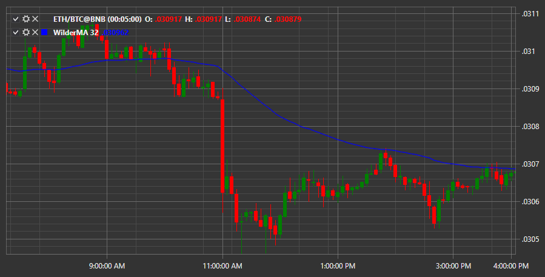

# Wilder MA

**Wilder-Gleitender Durchschnitt (WilderMA)** ist ein gewichteter gleitender Durchschnitt. Wie alle anderen gleitenden Durchschnitte glättet der WMA-Indikator Marktrauschen und stellt Markttrends klarer dar. Dazu filtert der Indikator Marktschwankungen (Rauschen), indem er die Preiswerte der Perioden mittelt, auf deren Grundlage er berechnet wird. Gleichzeitig wird den Durchschnittspreisen ein zusätzlicher Wert (Gewicht) hinzugefügt, wie es auch bei der Berechnung gewichteter Indikatoren wie EMA, LWMA und SMMA erfolgt.

Um den Indikator zu verwenden, nutzen Sie die Klasse [WilderMovingAverage](xref:StockSharp.Algo.Indicators.WilderMovingAverage).

## Empfohlene Inhalte

[Alligator](alligator.md)
