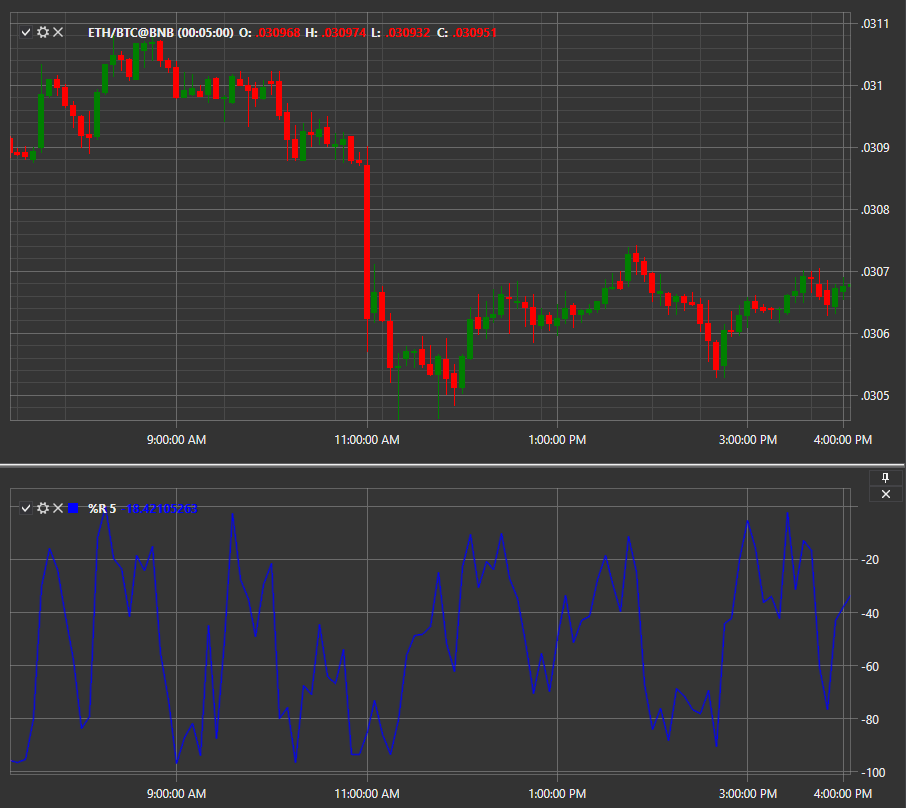

# %R

**Williams-%R (%R, Williams-Prozentbereich)** ist ein Momentum-Indikator, der zwischen 0 und -100 schwankt und überkaufte sowie überverkaufte Niveaus anzeigt.

Um den Indikator zu verwenden, nutzen Sie die Klasse [WilliamsR](xref:StockSharp.Algo.Indicators.WilliamsR).
##### Berechnung

Die Formel zur Berechnung des Williams-Prozentbereich-Indikators ähnelt der Formel des Stochastischer Oszillator:

%R = - (MAX(HIGH(i - n)) - CLOSE(i)) / (MAX(HIGH(i - n)) - MIN(LOW(i - n))) * 100

wobei gilt:

CLOSE(i) - heutiger Schlusskurs;
MAX(HIGH(i - n)) - höchstes Hoch der vergangenen n Perioden;
MIN(LOW(i - n)) - niedrigstes Tief der vergangenen n Perioden.

Der Wert von n wird als Indikatorparameter festgelegt.

## Siehe auch

[ZigZag](zigzag.md)

