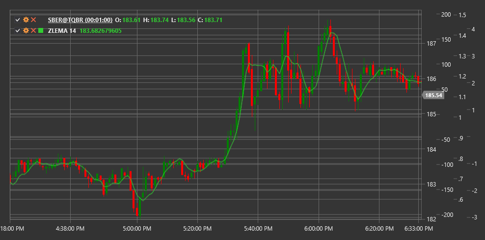

# ZLEMA

**Exponentieller gleitender Durchschnitt ohne Verzögerung (ZLEMA)** ist eine modifizierte Version des exponentiellen gleitenden Durchschnitts (EMA), entwickelt von John Ehlers. ZLEMA wurde entwickelt, um die Verzögerung herkömmlicher gleitender Durchschnitte zu beseitigen oder deutlich zu reduzieren.

Um den Indikator zu verwenden, nutzen Sie die Klasse [ZeroLagExponentialMovingAverage](xref:StockSharp.Algo.Indicators.ZeroLagExponentialMovingAverage).

## Beschreibung

Der exponentielle gleitende Durchschnitt ohne Verzögerung (ZLEMA) wurde geschaffen, um das Hauptproblem der meisten gleitenden Durchschnitte zu lösen - die Signalverzögerung. Traditionelle gleitende Durchschnitte hinken Preisbewegungen wegen des verwendeten Zeitfensters hinterher. ZLEMA minimiert diese Verzögerung durch einen Korrekturmechanismus, der auf der Differenz zwischen aktuellem Preis und einem Preis in der Vergangenheit basiert.

Wichtigste Vorteile von ZLEMA:
- Schnellere Reaktion auf Preisänderungen
- Weniger Verzögerung als bei traditionellen gleitenden Durchschnitten
- Erhaltung des für EMA typischen Glättungseffekts

ZLEMA kann verwendet werden für:
- Bestimmung der Trendrichtung
- Suche nach Ein- und Ausstiegspunkten
- Identifikation von Unterstützungs- und Widerstandsniveaus
- Erstellung von Handelssystemen auf Basis von Kreuzungen

## Parameter

- **Length** - Berechnungsperiode, die den Glättungsgrad bestimmt (ähnlich der Periode beim EMA).

## Berechnung

Die ZLEMA-Berechnung basiert auf der Beseitigung von Verzögerung durch Prognose und umfasst folgende Schritte:

1. Verzögerung als halbe Periode berechnen:
   ```
   lag = (Length - 1) / 2
   ```

2. Den "detrended" Preis berechnen:
   ```
   detrendedPrice = 2 * Price - Price[lag]
   ```
   Dies ist ein zentraler Schritt, der ein "Vorausschauen" ermöglicht und Verzögerung beseitigt.

3. Exponentielle Glättung auf den detrendedPrice anwenden:
   ```
   k = 2 / (Length + 1)
   ZLEMA = k * detrendedPrice + (1 - k) * ZLEMA[previous]
   ```

Das Ergebnis ist ein gleitender Durchschnitt, der dem Preis deutlich enger folgt als ein gewöhnlicher EMA mit derselben Periode und gleichzeitig den Glättungseffekt beibehält.



## Siehe auch

[EMA](ema.md)
[DEMA](dema.md)
[TEMA](tema.md)
[T3MA](t3_moving_average.md)
