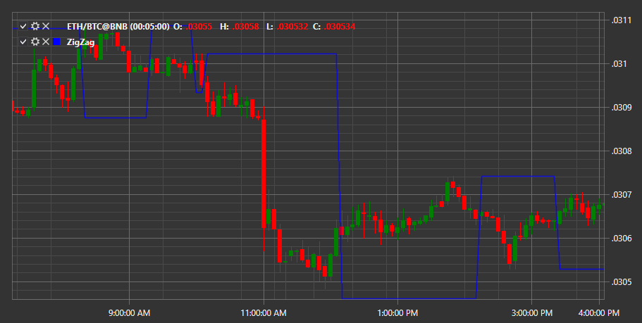

# ZigZag

**ZigZag** - der Indikator zeigt Punkte im Chart an, sobald sich Preise um einen Prozentsatz ändern, der den voreingestellten Wert überschreitet. Anschließend werden gerade Linien gezeichnet, die diese Punkte verbinden. Der Indikator wird zur Bestimmung von Preistrends verwendet.

Um den Indikator zu verwenden, nutzen Sie die Klasse [ZigZag](xref:StockSharp.Algo.Indicators.ZigZag).

