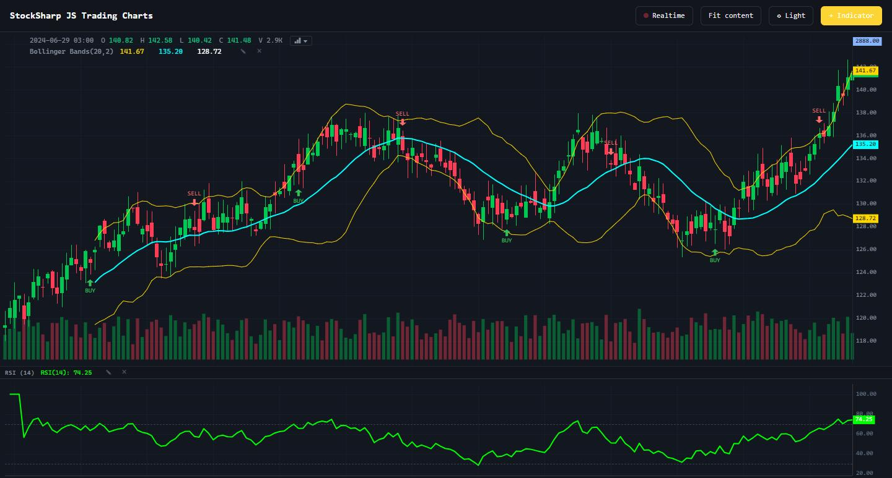

# JavaScript-Charts

[StockSharp JS Handels-Charts](https://github.com/StockSharp/JS-Charts) ist eine eigenständige, abhängigkeitsfreie Charting-Bibliothek für den Browser. Sie wird auf npm als [@stocksharp/chart](https://www.npmjs.com/package/@stocksharp/chart) veröffentlicht und liefert die `sschart`-Canvas-Engine, die im StockSharp-Web-Terminal verwendet wird. Eine funktionierende Version ist in der [Live-Demo](https://stocksharp.github.io/JS-Charts/demo/) verfügbar.



Anders als die Windows-Komponenten aus `StockSharp.Xaml.Charting` läuft diese Bibliothek im Browser und zeichnet direkt auf ein HTML-`canvas`. Die Engine wird über das globale `SSChart`-Objekt (aus `dist/sschart.js`) bereitgestellt und kann auch als ECMAScript-Module aus dem npm-Paket importiert werden (`import { createChart, CandlestickSeries } from '@stocksharp/chart'`).

## Live-Demo

Der Chart unten ist die echte Engine, die auf dieser Seite läuft — Kerzen mit einem Volumen-Histogramm und einem gleitenden Durchschnitt. Ziehen Sie zum Scrollen, zoomen Sie mit dem Mausrad und drücken Sie die Vergrößern-Schaltfläche (oben rechts), um ihn im Vollbild zu öffnen.

```chart-demo overview
```

## Funktionen

- Ein vollständiger Satz von Kursreihen: Candlesticks, OHLC-Balken, Linie, Fläche, Histogramm, Band, dazu die abgeleiteten Typen Heikin-Ashi, Renko und Point & Figure.
- Exakte Order-Flow-Studien: Footprint, Volumenprofil und TPO (Market Profile).
- Historisches Laden und Echtzeit-Updates über `setData` und `update`.
- Trade-Markierungen, Preislinien, Fadenkreuz, Zoomen, Scrollen und automatische Bereichsberechnung.
- Eine Indikator-Engine mit rund 160 Berechnungsimplementierungen.
- Overlay-Indikatoren, synchronisierte Oszillator-Bereiche und eine vom Fadenkreuz gesteuerte Legende.
- Helle und dunkle Themes, ein Kontextmenü, ein Indikator-Dialog und das Umschalten des Chart-Typs.

## Installation

Installieren Sie das Paket von npm und importieren Sie die ES-Module:

```bash
npm install @stocksharp/chart
```

```js
import { createChart, CandlestickSeries } from '@stocksharp/chart';
```

Oder binden Sie ohne Bundler das vorgefertigte globale `SSChart`-Objekt mit einem `<script>`-Tag ein, wie unten gezeigt.

## Einen Chart zu einer Seite hinzufügen

Der Build erzeugt `dist/sschart.js`, das `window.SSChart` bereitstellt. An die API übergebene Zeitwerte sind Unix-Zeitstempel in Sekunden.

```html
<div id="chart" style="width: 800px; height: 400px"></div>
<script src="dist/sschart.js"></script>
```

Erstellen Sie einen Chart, fügen Sie eine Reihe hinzu und laden Sie die Daten:

```js
const chart = SSChart.createChart(document.getElementById('chart'), {
  timeScale: { timeVisible: true },
  crosshair: { mode: SSChart.CrosshairMode.Normal },
});

const candles = chart.addSeries(SSChart.CandlestickSeries, {
  upColor: '#26a69a',
  downColor: '#ef5350',
  borderVisible: false,
});

candles.setData([
  { time: 1704153600, open: 120, high: 122, low: 119, close: 121 },
  { time: 1704240000, open: 121, high: 124, low: 120, close: 123 },
]);

candles.update({
  time: 1704326400,
  open: 123,
  high: 123.5,
  low: 122.8,
  close: 123.2,
});

chart.timeScale().fitContent();
```

Ein Aufruf von `update` mit dem aktuellen Zeitstempel ersetzt den letzten Punkt. Ein neuerer Zeitstempel hängt einen Punkt an.

## Chart-Modi

Jeder Reihentyp hat sein eigenes Thema mit einer Live-Demo und dem JavaScript, das ihn konfiguriert:

- [Kerzenchart](charts/candlestick.md) — klassische OHLC-Kerzen.
- [OHLC-Balken](charts/bar.md) — Open-/Close-Ticks an einem vertikalen Bereichsbalken.
- [Linie](charts/line.md) — eine einzelne Polylinie durch die Schlusskurse.
- [Fläche](charts/area.md) — eine Linie mit Gradientenfüllung.
- [Histogramm](charts/histogram.md) — vertikale Balken, typischerweise Volumen.
- [Band](charts/band.md) — ein oberer/unterer Kanal (Hüllkurven, Bollinger).
- [Heikin-Ashi-Kerzen](charts/heikin_ashi.md) — geglättete Kerzen, die Rauschen herausfiltern.
- [Renko](charts/renko.md) — kursgetriebene Bausteine, zeitunabhängig.
- [Point-&-Figure-Chart](charts/point_figure.md) — X/O-Spalten der Kursbewegung.
- [Footprint](charts/footprint.md) — Bid- × Ask-Volumen zu jedem Preis innerhalb jedes Balkens.
- [Volumenprofil](charts/volume_profile.md) — Volumen-pro-Preis mit POC und Value Area.
- [TPO (Market Profile)](charts/tpo.md) — die pro Session an jedem Preis verbrachte Zeit.

Neben den Reihentypen verfügt der Chart außerdem über eine [Indikator-Engine](charts/indicators.md) mit etwa 160 Studien und ein [verzögertes Nachladen der Historie](charts/backfill.md), das ältere Balken beim Scrollen lädt.

Für den visuellen Strategie-Editor, der vom selben Web-Stack gerendert wird, siehe [JavaScript-Diagramm](diagram.md).

## Schichten über der Engine

Alles bisher Beschriebene ist die Basis-Engine, der Einstiegspunkt `@stocksharp/chart`. Der Rest ist auf eigene veröffentlichte Einstiegspunkte verteilt: Importieren Sie den benötigten, ein Kopieren der Quellen ist nicht nötig.

| Einstiegspunkt | Was er bietet |
|---|---|
| [Chart-Oberfläche](charts/ui.md) — `@stocksharp/chart/ui` | Die fertige Oberfläche: Legende, Kontextmenü, Chart-Typ-Umschalter, Panel-Manager, Indikator-Dialog. Benötigt das Stylesheet `@stocksharp/chart/ui.css`. |
| `@stocksharp/chart/indicators` | `IndicatorEngine`, Indikator-Renderer und -Einstellungen. Die Berechnungen selbst liegen im Paket [@stocksharp/indicators](charts/indicators.md). |
| [Handel aus dem Chart](charts/trading.md) — `@stocksharp/chart/trading` | Die Handelsschicht: Auftragslinien, Position mit laufendem Ergebnis, Schutzaufträge und Quotierungen. Kennt keinen Broker — sie meldet eine Absicht, ausgeführt wird sie vom Host. |
| [Zeichenwerkzeuge](charts/drawings.md) — `@stocksharp/chart/drawings` | Zeichenwerkzeuge, Bindung an die Balken und Registrierung eigener Figuren. |
| [Mehrere Charts](charts/workspace.md) — `@stocksharp/chart/workspace` | Mehrere synchronisierte Charts, Instrumentenvergleich, Bereichsnavigator, Indikatorvorlagen. |
| [Layout speichern](charts/persistence.md) — `@stocksharp/chart/persistence` | Speichern und Wiederherstellen des Layouts mit Versionierung und Migrationen. |
| [Zeit und Handelssessions](charts/time.md) — `@stocksharp/chart/time` | Handelskalender, Sessions und Zeitzonen, Countdown bis zum Schluss eines Balkens. |
| `@stocksharp/chart/orderflow` | Clusteranalyse: Footprint und Volumenprofil. |

Ohne Bundler stehen dieselben Möglichkeiten über das Browserpaket bereit: `dist/sschartui.js` stellt das globale Objekt `SSChartUI` bereit.

## Aus dem Quellcode erstellen

Klonen Sie das Repository und verwenden Sie die enthaltenen npm-Skripte:

```bash
git clone https://github.com/StockSharp/JS-Charts.git
cd JS-Charts
npm install
npm run build
npm test
npm run serve
```

Der Entwicklungsserver stellt die Demo unter `http://localhost:8791/demo/index.html` bereit.

## Siehe auch

- [JavaScript-Diagramm](diagram.md)
- [JS-Charts-Repository](https://github.com/StockSharp/JS-Charts)
- [Live-Demo](https://stocksharp.github.io/JS-Charts/demo/)
- [Windows-Chart-Komponenten](../graphical_user_interface/charts.md)
