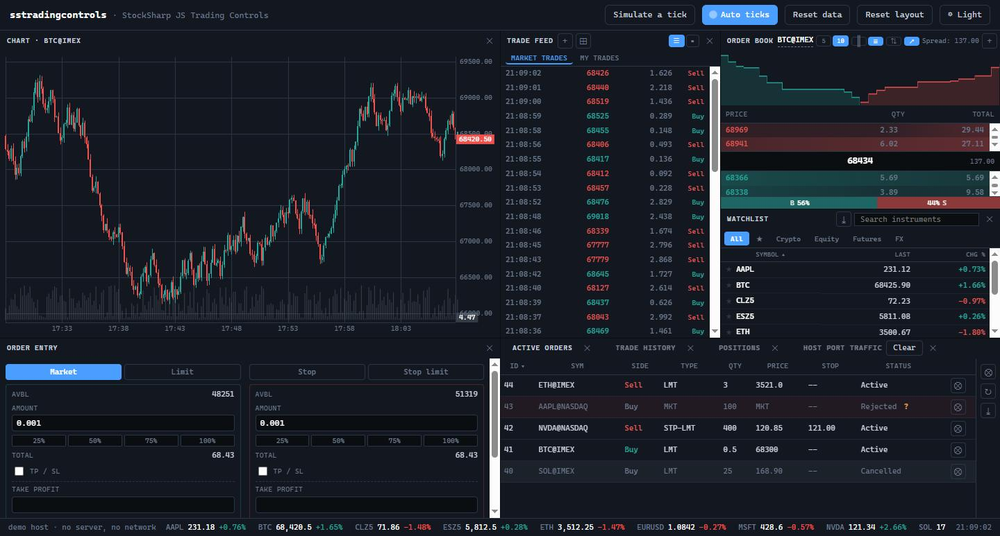

# JavaScript-Handelssteuerelemente

[StockSharp JS-Handelssteuerelemente](https://github.com/StockSharp/JS-TradingControls) ist eine Sammlung von Browserpanels für ein Handelsterminal. Das Paket ist als [`@stocksharp/trading-controls`](https://www.npmjs.com/package/@stocksharp/trading-controls) auf npm veröffentlicht; alle Steuerelemente können in der [Online-Demo](https://stocksharp.github.io/JS-TradingControls/demo/) betrachtet werden.



Die Abbildung zeigt außerdem ein Kerzendiagramm aus dem separaten Paket `@stocksharp/chart`. `@stocksharp/trading-controls` enthält fünfzehn eigenständige Steuerelemente:

| Steuerelement | Klasse | Kennung |
|---|---|---|
| [Aktive Aufträge](trading_controls/active_orders.md) | `ActiveOrdersWidget` | `activeOrders` |
| [Positionen](trading_controls/positions.md) | `PositionsWidget` | `positions` |
| [Ausführungshistorie](trading_controls/trade_history.md) | `TradeHistoryWidget` | `tradeHistory` |
| [Instrumentenliste](trading_controls/watchlist.md) | `WatchlistWidget` | `watchlist` |
| [Auftragseingabe](trading_controls/order_entry.md) | `OrderEntryWidget` | `orderEntry` |
| [Orderbuch](trading_controls/order_book.md) | `OrderBookWidget` | `orderbook` |
| [Handelsstrom](trading_controls/trade_feed.md) | `TradeFeedWidget` | `tradefeed` |
| [Statistik](trading_controls/statistics.md) | `StatisticsWidget` | `statistics` |
| [Protokoll](trading_controls/log_monitor.md) | `LogMonitorWidget` | `logMonitor` |
| [Strategien](trading_controls/strategies.md) | `StrategiesWidget` | `strategies` |
| [Optionsdesk](trading_controls/option_desk.md) | `OptionDeskWidget` | `optionDesk` |
| [Volatilitäts-Smile](trading_controls/option_smile.md) | `OptionSmileWidget` | `optionSmile` |
| [Equity-Kurve](trading_controls/equity.md) | `EquityWidget` | `equity` |
| [Optimierungs-Heatmap](trading_controls/optimization_heatmap.md) | `OptimizationHeatmapWidget` | `optimizationHeatmap` |
| [Optimierungsfläche](trading_controls/optimization_surface.md) | `SurfaceWidget` | `optimizationSurface` |

Die Kennungswerte sind über das exportierte Objekt `ControlTypes` verfügbar. Beachten Sie: Bei der Optimierungsfläche stimmt der Klassenname nicht mit der Kennung überein — die Klasse heißt `SurfaceWidget`, die Kennung `optimizationSurface`.

## Installation

```bash
npm install @stocksharp/trading-controls
```

Tabellen zeichnen die Steuerelemente über [@stocksharp/grids](grids.md) — das Paket kommt automatisch als gewöhnliche Abhängigkeit mit. [@stocksharp/chart](charts.md) ist dagegen als **Peer-Abhängigkeit** deklariert: npm installiert es nicht, und Sie müssen es selbst installieren, wenn Sie die Equity-Kurve oder den Volatilitäts-Smile verwenden — sie bauen auf der Chart-Engine auf.

```bash
npm install @stocksharp/chart
```

Neben dem Wurzelimport deklariert das Paket Unterpfade: einen je Steuerelement (`@stocksharp/trading-controls/watchlist` usw.), Hilfsmodule (`/trading-host`, `/control-types`, `/formatters`, `/dom`, `/trading-data`) und die parallele Familie `/source/*` mit den TypeScript-Quellen — für alle, die die Steuerelemente mit ihrem eigenen Bundler zusammen mit dem übrigen Code bauen.

Die Basisstile sind erforderlich. Die fertige helle und dunkle Farbpalette kann zusätzlich eingebunden oder durch eigene CSS-Variablen `--t-*` ersetzt werden:

```ts
import '@stocksharp/trading-controls/styles.css';
import '@stocksharp/trading-controls/theme.css'; // Optional: vorgefertigtes Theme.
```

Die Steuerelemente verwenden Klassen von [Bootstrap Icons](https://icons.getbootstrap.com/), liefern die Schriftarten und SVG-Dateien jedoch nicht selbst mit. Die Hostseite muss die Symbole separat einbinden.

Für Seiten ohne Bundler ist die Datei `dist/sstradingcontrols.js` vorgesehen, die das globale Objekt `window.SSTradingControls` erzeugt.

## Gemeinsames Erstellungsschema

Jedes Steuerelement wird mit der statischen Methode `create` erstellt. Die Methode prüft den Host, erzeugt das eigene DOM und fügt das Wurzelelement in den übergebenen Container ein:

```ts
import {
  PositionsWidget,
  type TradingHost,
} from '@stocksharp/trading-controls';

declare const host: TradingHost;

const positions = PositionsWidget.create(
  document.querySelector<HTMLElement>('#positions')!,
  {},
  {
    host,
    closePosition: (portfolioId, instrumentId, symbol) =>
      console.log('schließen', portfolioId, instrumentId, symbol),
    reversePosition: (portfolioId, instrumentId, symbol) =>
      console.log('umkehren', portfolioId, instrumentId, symbol),
    refreshPositions: () => console.log('aktualisieren'),
  },
);

positions.update([]);
```

Das zweite Argument ist der gespeicherte Zustand der Instanz. Die Abhängigkeiten im dritten Argument unterscheiden sich je nach Steuerelement: Das Positionspanel erhält beispielsweise Handler zum Schließen und Umkehren, während das Orderbuch Handler für die Auswahl und Ausführung eines Preises erhält.

## TradingHost-Vertrag

Die Steuerelemente greifen nicht direkt auf globale Übersetzungsfunktionen, Einstellungspeicher, Handelsverbindungen oder Fenstermanager zu. Jede externe Interaktion läuft über ein einziges Objekt `TradingHost`.

| Hostelement | Zweck |
|---|---|
| `isPrimary` | Kennzeichnet die primäre Instanz eines Steuerelements auf der Seite. |
| `t(key, ...args)` | Übersetzt sichtbaren Text und setzt Argumente ein. |
| `presentation` | Formatiert Seite, Typ und Status eines Auftrags sowie Gewinnklassen und die Canvas-Palette. |
| `preferences`, `cache` | Speichern dauerhafte Einstellungen und temporäre Daten. |
| `trading.api` | Sucht Instrumente und lädt Ausführungen. |
| `trading.marketData` | Verwaltet Abonnements und stellt aktive Aufträge bereit. |
| `trading.portfolioId()` | Gibt das aktuelle Portfolio zurück. |
| `trading.pickInstrument(...)` | Öffnet die Instrumentenauswahl. |
| `ticker` | Empfängt sichtbare Instrumente und deren Kurse. |
| `allow(action)` | Prüft die Berechtigung für eine Aktion. |
| `close`, `spawn`, `persistState`, `saveLayout` | Verwalten Lebenszyklus und Zustand des Panels. |
| `register`, `unregister`, `broadcast` | Registrieren Instanzen und verteilen Änderungen zwischen ihnen. |
| `log(message)` | Empfängt Diagnosemeldungen. |

Alle Elemente sind erforderlich. `assertHost` prüft verschachtelte Funktionen, bevor das Steuerelement gerendert wird, und meldet den genauen fehlenden Pfad. Wenn eine Anwendung einen Teil der Funktionen nicht benötigt, können für Pflichtbefehle sinnvolle Platzhalter übergeben werden, etwa `log: console.warn` oder ein leeres `saveLayout`.

## Lokalisierung und Gestaltung

Sichtbaren Text beziehen die Steuerelemente ausschließlich über `host.t`. Die vollständige aktuelle Liste mit 235 Schlüsseln wird als `@stocksharp/trading-controls/translation-keys.json` ausgeliefert. Das ist kein Array, sondern ein Objekt `{ $comment, count, keys }` — die Schlüssel selbst liegen im Feld `keys`. Ein unbekannter Schlüssel wird dem Benutzer unverändert angezeigt; deshalb muss der Host Übersetzungen für die gesamte Liste definieren.

Die Datei `styles.css` enthält Regeln, bezieht Farben, Schriftarten und Abmessungen jedoch aus den CSS-Variablen `--t-*`. Wenn das fertige `theme.css` nicht verwendet wird, muss die Anwendung diese Variablen definieren. Die Canvas-Farben für Orderbuch und Bubble-Tape liefert `host.presentation.canvasPalette()`.

## Ressourcen freigeben

Rufen Sie beim Entfernen eines Panels `dispose()` auf. Die Methode entfernt Handler, deaktiviert bei Bedarf Beobachter und Abonnements des jeweiligen Steuerelements und ruft anschließend `host.unregister` auf.

```ts
positions.dispose();
```

## Aus dem Quellcode erstellen

```bash
git clone https://github.com/StockSharp/JS-TradingControls.git
cd JS-TradingControls
npm install
npm test
npm run build
```

## Siehe auch

- [JavaScript-Tabellen](grids.md)
- [JavaScript-Charts](charts.md)
- [JS-TradingControls-Repository](https://github.com/StockSharp/JS-TradingControls)
- [Online-Demo](https://stocksharp.github.io/JS-TradingControls/demo/)
