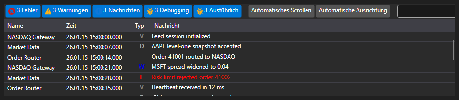

# Visuelles Monitoring

Zur Vereinfachung des Monitorings können Sie die spezielle Komponente [Monitor](xref:StockSharp.Xaml.Monitor) verwenden. Siehe auch [Visuelle Logging-Komponenten](../graphical_user_interface/logging.md).



Dieses Fenster ermöglicht die Anzeige von Nachrichten aus allen [ILogSource](xref:Ecng.Logging.ILogSource):

- Strategien ([Strategy](xref:StockSharp.Algo.Strategies.Strategy));
- Connectors ([IConnector](xref:StockSharp.BusinessEntities.IConnector));
- eigenen Implementierungen von [ILogSource](xref:Ecng.Logging.ILogSource) (zum Beispiel dem Hauptfenster des Algorithmus).

Die Verschachtelung der Quellen wird in Form eines Baums dargestellt. Jeder übergeordnete Knoten enthält Nachrichten aus allen untergeordneten Quellen und so weiter bis zur untersten Ebene. Für Connectors ist dies auch bei Verwendung von [BasketTrader](../connectors.md) nützlich. Ebenso kann dieselbe Verschachtelung für Ihren eigenen Algorithmus eingerichtet werden, indem Sie die Eigenschaft [ILogSource.Parent](xref:Ecng.Logging.ILogSource.Parent) implementieren.

## Verwenden von Monitor

1. Zuerst müssen Sie ein Fenster erstellen und die Komponente hinzufügen.
2. Danach muss das erstellte Fenster über [GuiLogListener](xref:StockSharp.Xaml.GuiLogListener) zu Ihrem [LogManager](xref:Ecng.Logging.LogManager) hinzugefügt werden:

   ```cs
   _logManager.Listeners.Add(new GuiLogListener(monitor));
   ```
3. Danach senden alle Quellen [LogManager.Sources](xref:Ecng.Logging.LogManager.Sources) (Strategien, Connectors usw.) Nachrichten an [Monitor](xref:StockSharp.Xaml.Monitor).

## Empfohlene Inhalte

[Visuelle Logging-Komponenten](../graphical_user_interface/logging.md)

