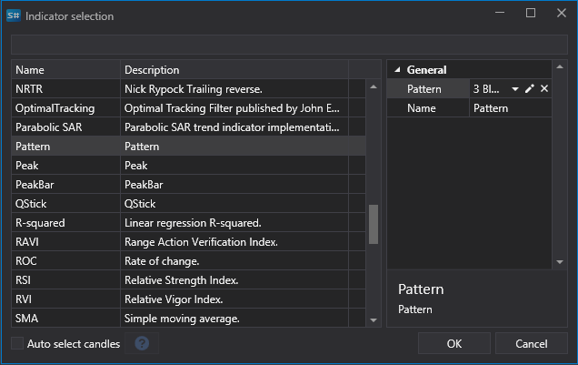

# Muster

**Pattern** (aus dem Englischen: pattern - Modell, Vorlage) bezeichnet in der technischen Analyse stabile, wiederkehrende Kombinationen aus Preisdaten, Volumen oder Indikatoren. Die Musteranalyse basiert auf einem der Axiome der technischen Analyse: "Geschichte wiederholt sich" - es wird angenommen, dass wiederkehrende Datenkombinationen zu ähnlichen Ergebnissen führen.

Patterns werden auch als "**Vorlagen**" oder "**Formationen**" der technischen Analyse bezeichnet.

Patterns werden üblicherweise unterteilt in:

- Unbestimmte Muster (können sowohl zur Fortsetzung als auch zur Änderung des aktuellen Trends führen).
- Fortsetzungsmuster des aktuellen Trends.
- Umkehrmuster eines bestehenden Trends.

## Verwenden von Patterns

### In Designer

[Designer](../designer.md) enthält integrierte vordefinierte Candlestick-Muster, die in Ihrer Handelsstrategie verwendet werden können. Patterns werden über den [Indikator](../designer/strategies/using_visual_designer/elements/common/indicator.md)-Würfel aufgerufen, anschließend wird der entsprechende Wert ausgewählt. Das Pattern selbst wird aus der Dropdown-Liste im rechten Fenster ausgewählt.



Es ist auch möglich, vorhandene Patterns zu bearbeiten und eigene benutzerdefinierte Patterns hinzuzufügen. Klicken Sie dazu auf die Schaltfläche ; danach wird das Fenster zur Pattern-Bearbeitung angezeigt.


Um ein eigenes Pattern zu erstellen, klicken Sie oben im Fenster auf die Schaltfläche . Ein Klick auf die Schaltfläche  löscht das Pattern.

### In Terminal

In [Terminal](../terminal.md) werden Patterns wie jeder andere Indikator zum Chart hinzugefügt. Klicken Sie dazu einfach mit der rechten Maustaste auf den Chart und wählen Sie den passenden Indikator aus der Liste der verfügbaren Indikatoren aus.

### In StockSharp API

Bei Verwendung von [S#](../api.md) (oder beim Erstellen von [Strategien aus Code](../designer/strategies/using_code.md) in Designer) erfolgt die Arbeit mit Patterns wie bei jedem anderen Indikator. Verwendungsbeispiel:

```cs
// Erstellen eines Pattern-Indikators
var patternIndicator = new CandlePatternIndicator
{
	// Festlegen des gewünschten Patterns
	Pattern = new ExpressionCandlePattern("My pattern", new[]
	{
		new CandleExpressionCondition(Paths.FileSystem, "C > O"), // Current candle is rising
		new CandleExpressionCondition(Paths.FileSystem, "pC < pO") // Previous candle is falling
	})
};

// Indikator zur Sammlung hinzufügen
Indicators.Add(patternIndicator);

// Eine Candle verarbeiten
var result = patternIndicator.Process(candle);

// Ergebnis prüfen
if (result.GetValue<bool>())
{
	// Pattern detected, perform necessary actions
}
```

## Format der Pattern-Beschreibung

Beim Bearbeiten eines Patterns stellt jede Zeile eine separate Candle dar. Die oberste Zeile ist die aktuelle Candle; entsprechend ist die zweite Zeile eine Candle zurück, die dritte und die folgenden Zeilen sind minus 2 und weitere Candles.

Der Editor verwendet die folgenden Parameter:
- O - Eröffnungskurs,
- H - Hoch,
- L - Tief,
- C - Schlusskurs,
- V - Volumen,
- OI - Open Interest,
- B - Candle-Körper,
- LEN - Länge der Candle (vom Hoch bis zum Tief),
- BS - unterer Schatten der Candle,
- TS - oberer Schatten der Candle.

Mit Parametern können die folgenden Indizes (Referenzen) auf die gewünschten Werte verwendet werden. Beispiel für den Schlusskurs:
- C: Schlusskurs der aktuellen Candle,
- C1: Schlusskurs der 1. Candle nach der aktuellen Candle,
- C2: Schlusskurs der 2. Candle nach der aktuellen Candle,
- pC: Schlusskurs der vorherigen Candle,
- pC1: Schlusskurs der Candle vor der vorherigen Candle,
Alle Referenzen müssen innerhalb des Bereichs des aktuellen Patterns liegen. Der Bereich des Patterns 3 Black Crows besteht beispielsweise aus der aktuellen und zwei vorherigen Candles; daher ist ein Verweis auf die dritte vorherige Candle nicht zulässig.

Für zusätzliche Prüfungen von Parametern in Korrelation wird der Ausdruck && verwendet, der ein logisches UND darstellt.

Beim Beschreiben eines Patterns können außerdem die folgenden Funktionen verwendet werden: abs, acos, asin, atan, ceiling, cos, exp, floor, log, log10, max, min, pow, round, sign, sin, sqrt, tan, truncate. Mehr zur Verwendung von Funktionen wird in der Beschreibung des [Formel](../designer/strategies/using_visual_designer/elements/common/formula.md)-Würfels erläutert.

Bei Verwendung von [ExpressionCandlePattern](xref:StockSharp.Algo.Candles.Patterns.ExpressionCandlePattern) im Code werden Formeln nach denselben Regeln wie oben beschrieben erstellt und verwenden dieselben Variablen.

## Standard-Patterns

Für die schnelle Erstellung von Patterns auf Basis vorhandener Patterns können Sie den Bereich am unteren Rand des Pattern-Editor-Fensters verwenden. Ein Klick auf die Schaltfläche  am unteren Fensterrand fügt die Logik des in der gegenüberliegenden Dropdown-Liste ausgewählten Patterns in das Bearbeitungsfenster ein. Die Schaltfläche  am unteren Fensterrand löscht die ausgewählte Zeile im Bearbeitungsfenster.

## Erweiterte Funktionen

- [ComplexCandlePattern](xref:StockSharp.Algo.Candles.Patterns.ComplexCandlePattern) - ermöglicht das Kombinieren mehrerer Patterns zu einem einzelnen zusammengesetzten Pattern für komplexere Analysen.
- [ICandlePatternProvider](xref:StockSharp.Algo.Candles.Patterns.ICandlePatternProvider) - Interface des Pattern-Providers, das das Laden und Speichern benutzerdefinierter Patterns ermöglicht.
