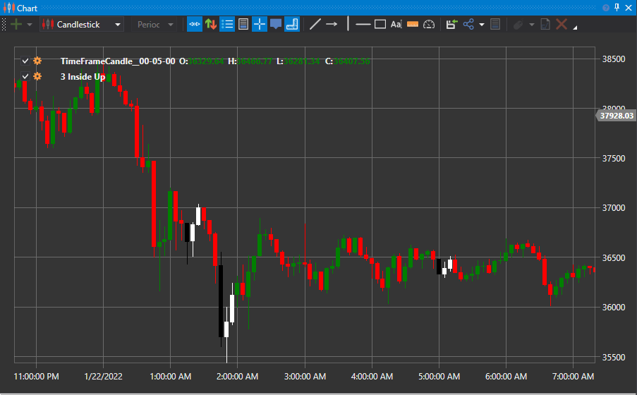

# Drei innen abwärts und Drei innen aufwärts

Die Begriffe Drei innen abwärts und Drei innen aufwärts bezeichnen ein Paar von Umkehr-Candlestick-Mustern (jeweils mit drei einzelnen Candles), die in Candlestick-Charts angezeigt werden. Für das Muster müssen drei Candles in einer bestimmten Reihenfolge entstehen, was darauf hinweist, dass der aktuelle Trend an Momentum verloren hat und eine Bewegung in die Gegenrichtung beginnen kann.

##### Hauptmerkmale:

- Das Muster Drei innen aufwärts ist ein bullisches Umkehrmuster, das aus einer großen Abwärts-Candle, einer kleineren Aufwärts-Candle innerhalb der vorherigen Candle und einer weiteren Aufwärts-Candle besteht, die über dem Schlusskurs der zweiten Candle schließt.
- Das Muster Drei innen abwärts ist ein bärisches Umkehrmuster, das aus einer großen Aufwärts-Candle, einer kleineren Abwärts-Candle innerhalb der vorherigen Candle und einer weiteren Abwärts-Candle besteht, die unter dem Schlusskurs der zweiten Candle schließt.
- Diese Muster sind kurzfristiger Natur und führen nicht immer zu einer deutlichen oder auch nur kleinen Trendänderung.
- Erwägen Sie, diese Muster im Kontext des Gesamttrends zu verwenden. Nutzen Sie beispielsweise Drei innen aufwärts während eines Pullbacks in einem übergeordneten Aufwärtstrend.

### Drei innen aufwärts

Die aufwärtsgerichtete Variante des Musters ist bullisch und zeigt an, dass die Abwärtsbewegung des Preises enden und eine Aufwärtsbewegung beginnen kann. Dies sind die Merkmale des Musters:

1. Der Markt befindet sich in einem Abwärtstrend oder bewegt sich nach unten.
2. Die erste Candle ist eine schwarze (abwärtsgerichtete) Candle mit großem Körper.
3. Die zweite Candle ist eine weiße (aufwärtsgerichtete) Candle mit kleinem Körper, die innerhalb des Körpers der ersten Candle eröffnet und schließt.
4. Die dritte Candle ist eine weiße (aufwärtsgerichtete) Candle, die über dem Schlusskurs der zweiten Candle schließt.

### Drei innen abwärts

Die abwärtsgerichtete Variante des Musters ist bärisch. Sie zeigt, dass die Aufwärtsbewegung des Preises endet und der Preis beginnt, nach unten zu laufen. Dies sind die Merkmale des Musters:

1. Der Markt befindet sich in einem Aufwärtstrend oder bewegt sich nach oben.
2. Die erste Candle ist eine weiße Candle mit großem Körper.
3. Die zweite Candle ist eine schwarze Candle mit kleinem Körper, die innerhalb des Körpers der ersten Candle eröffnet und schließt.
4. Die dritte Candle ist eine schwarze Candle, die unter dem Schlusskurs der zweiten Candle schließt.

Diese Muster sind im Kern Harami-Muster, denen eine bestätigende Candle folgt, auf die viele Trader bei Haramis warten.

## Siehe auch

[Drei außen abwärts und Drei außen aufwärts](3_outside_down_3_outside_up.md)

