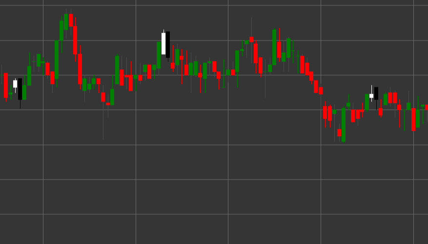

# Bärisches Engulfing

Bearish Engulfing ist ein starkes bärisches Umkehr-Candlestick-Muster aus zwei Candles, das in einem Aufwärtstrend entsteht. Die erste Candle ist weiß (bullisch), gefolgt von einer schwarzen (bärischen) Candle, deren Körper den Körper der vorherigen Candle vollständig umschließt (überdeckt).

##### Hauptmerkmale:

- Die erste Candle ist weiß, mit Eröffnungskurs unterhalb des Schlusskurses (O < C).
- Die zweite Candle ist schwarz, mit Eröffnungskurs oberhalb des Schlusskurses (O > C).
- Der Eröffnungskurs der zweiten Candle liegt über dem Schlusskurs der ersten Candle (O > pC).
- Der Schlusskurs der zweiten Candle liegt unter dem Eröffnungskurs der ersten Candle (C < pO).
- Der Körper der zweiten Candle umschließt den Körper der ersten Candle vollständig.
- Entsteht in einem Aufwärtstrend.

### Interpretation

Bearish Engulfing gilt als eines der zuverlässigsten Signale für eine Umkehr eines Aufwärtstrends:

- Die erste Candle bestätigt den bestehenden Aufwärtstrend und zeigt die Kontrolle der Käufer.
- Die zweite Candle zeigt einen abrupten Kontrollwechsel zu den Verkäufern, die nicht nur den Gewinn der vorherigen Periode auslöschen, sondern auch einen deutlichen Rückgang erzeugen.
- Das vollständige Umschließen des vorherigen Candle-Körpers symbolisiert einen vollständigen Stimmungswechsel von bullisch zu bärisch.
- Je größer die zweite Candle im Vergleich zur ersten ist, desto stärker ist das Signal.
- Wenn sich das Muster an einem Widerstandsniveau oder nach einem längeren Aufwärtstrend bildet, nimmt seine Bedeutung zu.

### Handelsstrategien

Bearish Engulfing bietet gute Möglichkeiten für den Einstieg in eine Short-Position:

- Einstieg in eine Short-Position nach Bildung des Musters, üblicherweise bei Eröffnung der nächsten Candle.
- Platzieren eines Stop-Loss oberhalb des Hochs der zweiten Candle des Musters.
- Das Gewinnziel kann auf Basis vorheriger Unterstützungsniveaus, des Risiko-Ertrags-Verhältnisses oder technischer Indikatoren gesetzt werden.
- Hohes Handelsvolumen während der Bildung der zweiten Candle erhöht die Zuverlässigkeit des Signals deutlich.
- Kombination mit anderen Indikatoren, etwa RSI in der überkauften Zone oder Divergenzen bei Oszillatoren, um die Wahrscheinlichkeit eines erfolgreichen Trades zu erhöhen.
- Kann auch als Signal zum Schließen bestehender Long-Positionen verwendet werden.

