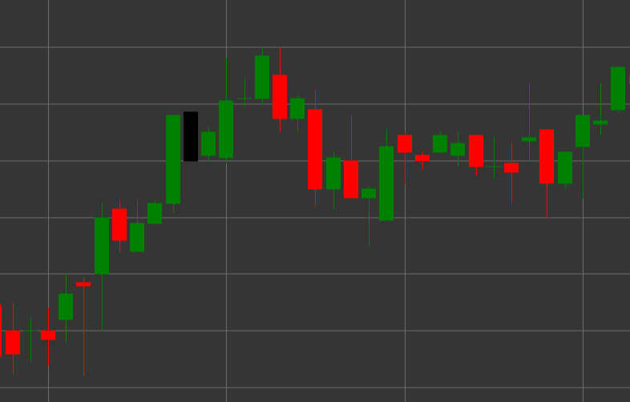

# Pattern Black Marubozu

Black Marubozu ist ein bärisches Candlestick-Muster, das durch das Fehlen von Schatten an beiden Enden der Candle gekennzeichnet ist. Der Begriff "Marubozu" stammt aus dem Japanischen und bedeutet "kahlköpfig" oder "rasiert", was das Erscheinungsbild der Candle ohne Schatten beschreibt.

##### Hauptmerkmale:

- Der Eröffnungskurs ist höher als der Schlusskurs (O > C).
- Der Candle-Körper ist vollständig gefüllt, ohne obere und untere Schatten.
- Der Eröffnungskurs entspricht dem Hoch der Candle, und der Schlusskurs entspricht dem Tief der Candle.
- Stellt eine starke bärische Bewegung dar, bei der Verkäufer während der gesamten Periode den Preis kontrollierten.

### Interpretation

Black Marubozu gilt als starkes bärisches Signal:

- Das Fehlen von Schatten weist auf vollständige Dominanz der Verkäufer hin - der Preis eröffnete am Hoch und fiel kontinuierlich bis zum Periodenschluss.
- Ein langer Black Marubozu zeigt sehr starken bärischen Druck.
- Das Auftreten dieses Musters nach einem Aufwärtstrend kann eine Umkehr signalisieren.
- Innerhalb eines Abwärtstrends bestätigt es die Stärke der Bewegung.

### Handelsstrategien

Black Marubozu liefert ein stärkeres Signal als eine reguläre schwarze Candle:

- Möglichkeit zum Einstieg in eine Short-Position nach Bildung eines Black Marubozu, insbesondere wenn er an einem wichtigen Widerstandsniveau erscheint.
- Verwendung des Schlusskurses des Black Marubozu als Widerstandsniveau beim Setzen von Stop-Losses.
- Kombination mit anderen technischen Indikatoren zur Bestätigung des Signals.
- Achten Sie auf das Handelsvolumen - hohes Volumen erhöht die Bedeutung des Signals.

## Siehe auch

[Pattern White Marubozu](white_marubozu.md)

[Pattern Black Candle](black_candle.md)

