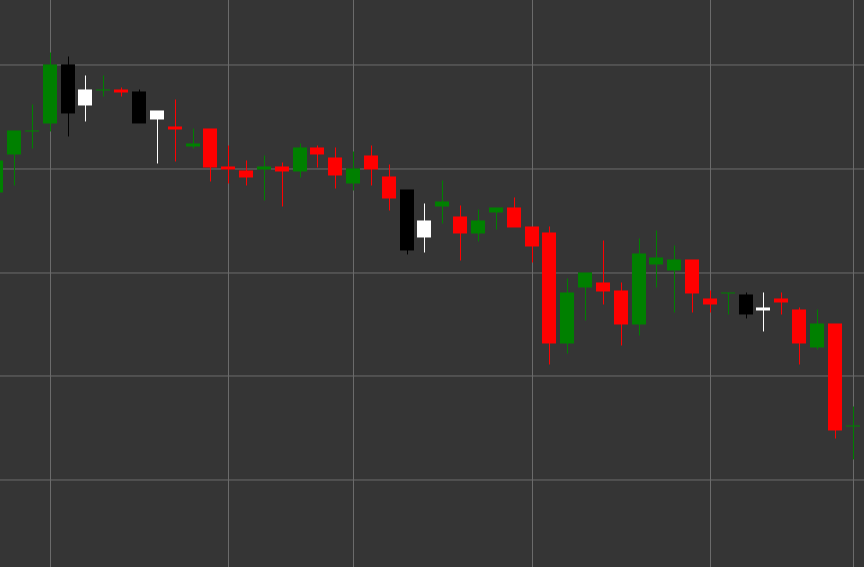

# Bullischer Harami

Bullish Harami ist ein Umkehr-Candlestick-Muster aus zwei Candles, das in einem Abwärtstrend entsteht. Der Begriff "Harami" stammt aus dem Japanischen und bedeutet "Schwangerschaft", da die kleine Candle (Kind) im Körper der großen Candle (Mutter) enthalten ist.

##### Hauptmerkmale:

- Die erste Candle ist schwarz (bärisch), mit Eröffnungskurs oberhalb des Schlusskurses (O > C) und einem langen Körper.
- Die zweite Candle ist weiß (bullisch), mit Eröffnungskurs unterhalb des Schlusskurses (O < C) und einem kleineren Körper.
- Der Körper der zweiten Candle liegt vollständig innerhalb des Körpers der ersten Candle (O > pC) und (C < pO).
- Entsteht in einem Abwärtstrend.

### Interpretation

Bullish Harami signalisiert ein mögliches Ende eines Abwärtstrends:

- Die erste Candle bestätigt den bestehenden Abwärtstrend und die Stärke der Verkäufer.
- Die zweite Candle, die vollständig innerhalb der ersten liegt, weist auf nachlassendes bärisches Momentum und ein mögliches Auftreten von Käufern hin.
- Je kleiner der Körper der zweiten Candle im Vergleich zur ersten ist, desto ausgeprägter sind Unsicherheit und Umkehrpotenzial.
- Wenn die zweite Candle ein Doji ist (mit sehr kleinem Körper), wird das Muster als "Harami Cross" bezeichnet und gilt als stärkeres Unsicherheitssignal.
- Dieses Muster gilt häufig als schwächeres Signal als Bullish Engulfing, kann aber ein früherer Hinweis auf eine mögliche Umkehr sein.

### Handelsstrategien

Bullish Harami erfordert für den Positionseinstieg normalerweise zusätzliche Bestätigung:

- Warten Sie nach der Musterbildung auf eine bestätigende bullische Candle, bevor Sie in eine Long-Position einsteigen.
- Platzieren Sie einen Stop-Loss unterhalb des Tiefs des Musters oder unterhalb des Tiefs der ersten Candle.
- Verwenden Sie das Handelsvolumen als zusätzliche Bestätigung - sinkendes Volumen bei der zweiten Candle und steigendes Volumen bei nachfolgenden bullischen Candles verstärken das Signal.
- Kombinieren Sie das Muster mit anderen technischen Indikatoren, etwa RSI in der überverkauften Zone oder Oszillator-Divergenzen.
- Berücksichtigen Sie das Muster an Unterstützungsniveaus oder in überverkauften Zonen, um die Wahrscheinlichkeit eines erfolgreichen Trades zu erhöhen.
- Mögliche Verwendung zum Schließen bestehender Short-Positionen, auch wenn das Signal nicht stark genug ist, um Long-Positionen zu eröffnen.

## Siehe auch

[Bärischer Harami](bearish_harami.md)

[Bullisches Engulfing](bullish_engulfing.md)
