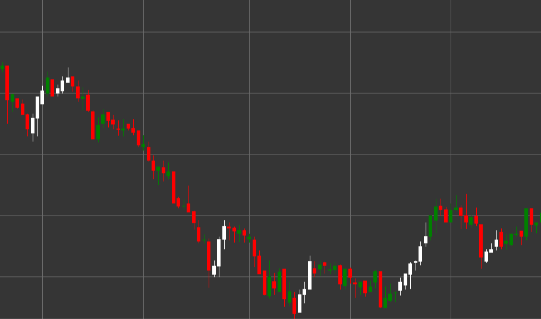

# Pattern Three White Soldiers

Three White Soldiers ist ein starkes bullisches Umkehr-Candlestick-Muster aus drei aufeinanderfolgenden Candles, das in einem Abwärtstrend entsteht. Dieses Muster weist auf einen entschiedenen Kontrollwechsel von Verkäufern zu Käufern hin und signalisiert eine mögliche Umkehr eines Abwärtstrends.

##### Hauptmerkmale:

- Drei aufeinanderfolgende weiße (bullische) Candles mit Eröffnungskurs unterhalb des Schlusskurses (O < C).
- Jede nachfolgende Candle eröffnet innerhalb des Körpers der vorherigen Candle (O > pO).
- Jede Candle schließt höher als der Schlusskurs der vorherigen Candle.
- Alle drei Candles haben relativ länge Körper und kurze Schatten.
- Entsteht in einem Abwärtstrend.

### Interpretation

Three White Soldiers gilt als eines der zuverlässigsten Signale für die Umkehr eines Abwärtstrends:

- Die Abfolge von drei steigenden Candles zeigt einen stetigen Anstieg bullischen Drucks.
- Die Eröffnung jeder nachfolgenden Candle innerhalb des Körpers der vorherigen deutet auf eine gewisse Konsolidierung und anschließend auf die Fortsetzung der bullischen Bewegung hin.
- Dass jede Candle höher als die vorherige schließt, zeigt die Fähigkeit der Käufer, den Preis konsequent anzuheben.
- Relativ länge Candle-Körper mit kurzen Schatten weisen auf eine entschlossene Kontrolle der Bullen über den Markt hin.
- Je gleichmäßiger die Größen der drei Candles sind, desto stärker ist das Signal.

### Handelsstrategien

Three White Soldiers bietet zuverlässige Möglichkeiten für den Einstieg in eine Long-Position:

- Einstieg in eine Long-Position nach Bildung des vollständigen Musters, üblicherweise bei Eröffnung der vierten Candle.
- Platzieren eines Stop-Loss unterhalb des Tiefs der dritten Candle oder unterhalb des Tiefs des gesamten Musters.
- Das Gewinnziel kann auf Basis von Fibonacci-Niveaus oder vorherigen Widerstandsniveaus festgelegt werden.
- Achten Sie auf das Volumen - steigendes Volumen bei jeder Candle bestätigt die Stärke des Signals.
- Gehen Sie bei extrem langen Candle-Körpern vorsichtiger vor, da aufgrund überkaufter Bedingungen eine kurzfristige Korrektur folgen kann.
- Kombinieren Sie das Muster mit anderen technischen Indikatoren wie RSI, um die Wahrscheinlichkeit eines erfolgreichen Trades zu erhöhen.

## Siehe auch

[Pattern Three Black Crows](three_black_crows.md)

[Pattern Rising Three Methods](rising_three_methods.md)
