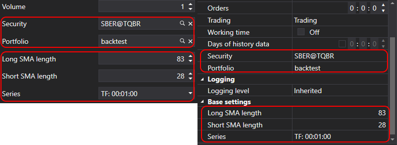

# Strategieparameter

Für Strategiekonfiguration und -optimierung stellt StockSharp die spezielle Klasse [StrategyParam\<T\>](xref:StockSharp.Algo.Strategies.StrategyParam`1) bereit. Strategieparameter ermöglichen es, Einstellungen eines Handelsalgorithmus zu ändern, ohne den Code anzupassen. Das ist besonders praktisch beim Wechsel zwischen Test- und Live-Handelsmodus. Außerdem werden diese Parameter während der Optimierung verwendet, um Werte automatisch zu durchlaufen und optimale Strategieeinstellungen zu finden.

Im Gegensatz zu normalen C#-Eigenschaften werden mit dieser Klasse erstellte Parameter automatisch in visuellen Einstellungen angezeigt, beispielsweise im Designer, und können für die Strategieoptimierung verwendet werden.

## Erstellen von Strategieparametern

Parameter werden im Strategiekonstruktor mit der Methode [Strategy.Param](xref:StockSharp.Algo.Strategies.Strategy.Param``1(System.String,``0)) erstellt:

```cs
public class SmaStrategy : Strategy
{
	private readonly StrategyParam<int> _longSmaLength;

	public int LongSmaLength
	{
		get => _longSmaLength.Value;
		set => _longSmaLength.Value = value;
	}

	public SmaStrategy()
	{
		_longSmaLength = Param(nameof(LongSmaLength), 80)
							.SetGreaterThanZero()
							.SetDisplay("Länge der langen SMA", string.Empty, "Grundeinstellungen");
	}
}
```

In diesem Beispiel wird ein Parameter `LongSmaLength` mit dem Anfangswert 80 erstellt, ein Validator gesetzt, der sicherstellt, dass der Wert größer als null ist, und Anzeigeeinstellungen für die Benutzeroberfläche werden konfiguriert.

## Methoden zur Parameterkonfiguration

Die Klasse [StrategyParam\<T\>](xref:StockSharp.Algo.Strategies.StrategyParam`1) stellt mehrere Methoden zur Parameterkonfiguration bereit:

### SetDisplay

Die Methode [StrategyParam\<T\>.SetDisplay](xref:StockSharp.Algo.Strategies.StrategyParam`1.SetDisplay(System.String,System.String,System.String)) legt Anzeigename, Beschreibung und Kategorie des Parameters fest:

```cs
_longSmaLength = Param(nameof(LongSmaLength), 80)
					.SetDisplay("Länge der langen SMA", "Periode des langen gleitenden Durchschnitts", "Grundeinstellungen");
```

### SetValidator

Die Methode [StrategyParam\<T\>.SetValidator](xref:Ecng.ComponentModel.Extensions.SetValidator``1(``0,System.ComponentModel.DataAnnotations.ValidationAttribute)) legt einen Validator zur Prüfung des Parameterwerts fest. StockSharp stellt eine Reihe vordefinierter Validatoren bereit, die für die häufigsten Aufgaben verwendet werden können:

```cs
// Prüfen, dass die Zahl größer als null ist
_longSmaLength = Param(nameof(LongSmaLength), 80)
					.SetValidator(new IntGreaterThanZeroAttribute());

// Prüfen, dass die Zahl nicht negativ ist
_volume = Param(nameof(Volume), 1)
			.SetValidator(new DecimalNotNegativeAttribute());

// Wertebereich prüfen
_percentage = Param(nameof(Percentage), 50)
				.SetValidator(new RangeAttribute(0, 100));

// Pflichtwert prüfen
_security = Param<Security>(nameof(Security))
				.SetValidator(new RequiredAttribute());
```

Zur Vereinfachung verfügt [StrategyParam\<T\>](xref:StockSharp.Algo.Strategies.StrategyParam`1) über integrierte Methoden für die häufigsten Validatoren:

```cs
// Prüfen, dass die Zahl größer als null ist
_longSmaLength = Param(nameof(LongSmaLength), 80).SetGreaterThanZero();

// Prüfen, dass die Zahl nicht negativ ist
_volume = Param(nameof(Volume), 1).SetNotNegative();

// Prüfen, dass der Wert NULL oder nicht negativ ist
_interval = Param<TimeSpan?>(nameof(Interval)).SetNullOrNotNegative();

// Wertebereich festlegen
_percentage = Param(nameof(Percentage), 50).SetRange(0, 100);
```

Wenn die integrierten Validatoren nicht ausreichen, können Sie eigene erstellen, indem Sie von [ValidationAttribute](https://docs.microsoft.com/en-us/dotnet/api/system.componentmodel.dataannotations.validationattribute) erben:

```cs
public class EvenNumberAttribute : ValidationAttribute
{
	public EvenNumberAttribute()
		: base("Der Wert muss eine gerade Zahl sein.")
	{
	}

	public override bool IsValid(object value)
	{
		if (value is int intValue)
			return intValue % 2 == 0;

		return false;
	}
}

// Benutzerdefinierten Validator verwenden
_barCount = Param(nameof(BarCount), 10)
				.SetValidator(new EvenNumberAttribute());
```

### SetHidden

Die Methode [StrategyParam\<T\>.SetHidden](xref:StockSharp.Algo.Strategies.StrategyParam`1.SetHidden(System.Boolean)) blendet den Parameter im Eigenschaftseditor aus:

```cs
_systemParam = Param(nameof(SystemParam), "value")
				.SetHidden(true);
```

### SetBasic

Die Methode [StrategyParam\<T\>.SetBasic](xref:StockSharp.Algo.Strategies.StrategyParam`1.SetBasic(System.Boolean)) markiert den Parameter als Basisparameter. Dies beeinflusst seine Anzeige in der Benutzeroberfläche. Basisparameter werden im vereinfachten Modus des Eigenschaftseditors angezeigt:

```cs
_longSmaLength = Param(nameof(LongSmaLength), 80)
					.SetBasic(true);
```



### SetReadOnly

Die Methode [StrategyParam\<T\>.SetReadOnly](xref:StockSharp.Algo.Strategies.StrategyParam`1.SetReadOnly(System.Boolean)) macht den Parameter schreibgeschützt:

```cs
_calculatedParam = Param(nameof(CalculatedParam), 0)
					.SetReadOnly(true);
```

### SetCanOptimize und SetOptimize

Die Methoden [StrategyParam\<T\>.SetCanOptimize](xref:StockSharp.Algo.Strategies.StrategyParam`1.SetCanOptimize(System.Boolean)) und [StrategyParam\<T\>.SetOptimize](xref:StockSharp.Algo.Strategies.StrategyParam`1.SetOptimize(`0,`0,`0)) geben an, ob der Parameter für die Optimierung verwendet werden kann, und legen den Wertebereich für die Optimierung fest:

```cs
_longSmaLength = Param(nameof(LongSmaLength), 80)
					.SetCanOptimize(true)
					.SetOptimize(10, 200, 10);
```

Im obigen Beispiel wird der Parameter im Bereich von 10 bis 200 mit einer Schrittweite von 10 optimiert.

## Verwendung von Parametern in der Strategie

Strategieparameter werden wie normale Eigenschaften verwendet:

```cs
protected override void OnStarted2(DateTime time)
{
	base.OnStarted2(time);

	_shortSma = new SimpleMovingAverage { Length = ShortSmaLength };
	_longSma = new SimpleMovingAverage { Length = LongSmaLength };

	// ...
}
```

## Speichern und Laden von Parametern

Parameterwerte werden in der Basisklasse [Strategy](xref:StockSharp.Algo.Strategies.Strategy) automatisch gespeichert und geladen. Wenn Sie die Methoden [Strategy.Save](xref:StockSharp.Algo.Strategies.Strategy.Save(Ecng.Serialization.SettingsStorage)) und [Strategy.Load](xref:StockSharp.Algo.Strategies.Strategy.Load(Ecng.Serialization.SettingsStorage)) überschreiben, müssen Sie die Methoden der Basisklasse aufrufen:

```cs
public override void Save(SettingsStorage settings)
{
	base.Save(settings);

	// Zusätzliche Speicherlogik...
}

public override void Load(SettingsStorage settings)
{
	base.Load(settings);

	// Zusätzliche Ladelogik...
}
```

## Beispiel: Strategie mit mehreren Parametern

Unten sehen Sie ein Beispiel für eine Strategie mit mehreren Parametern:

```cs
public class SmaStrategy : Strategy
{
	private readonly StrategyParam<DataType> _series;
	private readonly StrategyParam<int> _longSmaLength;
	private readonly StrategyParam<int> _shortSmaLength;

	public DataType Serie
	{
		get => _series.Value;
		set => _series.Value = value;
	}

	public int LongSmaLength
	{
		get => _longSmaLength.Value;
		set => _longSmaLength.Value = value;
	}

	public int ShortSmaLength
	{
		get => _shortSmaLength.Value;
		set => _shortSmaLength.Value = value;
	}

	public SmaStrategy()
	{
		base.Name = "SMA strategy";

		Param("TypeId", GetType().GetTypeName(false)).SetHidden();
		_longSmaLength = Param(nameof(LongSmaLength), 80)
							.SetGreaterThanZero()
							.SetDisplay("Länge der langen SMA", string.Empty, "Grundeinstellungen")
							.SetCanOptimize(true)
							.SetOptimize(20, 200, 10);

		_shortSmaLength = Param(nameof(ShortSmaLength), 30)
							.SetGreaterThanZero()
							.SetDisplay("Länge der kurzen SMA", string.Empty, "Grundeinstellungen")
							.SetCanOptimize(true)
							.SetOptimize(5, 50, 5);

		_series = Param(nameof(Serie), DataType.TimeFrame(TimeSpan.FromMinutes(15)))
					.SetDisplay("Serie", string.Empty, "Grundeinstellungen");
	}

	// ...
}
```

In diesem Beispiel wurde eine Strategie auf Basis der Kreuzung zweier gleitender Durchschnitte mit drei konfigurierbaren Parametern erstellt:
- `Serie` - Datentyp und Zeitrahmen
- `LongSmaLength` - Periode des langen gleitenden Durchschnitts
- `ShortSmaLength` - Periode des kurzen gleitenden Durchschnitts

Für die beiden numerischen Parameter wurden Optimierungsfunktionen mit festgelegten Bereichen konfiguriert.

## Siehe auch

[Speichern und Laden von Einstellungen](settings_saving_and_loading.md)

