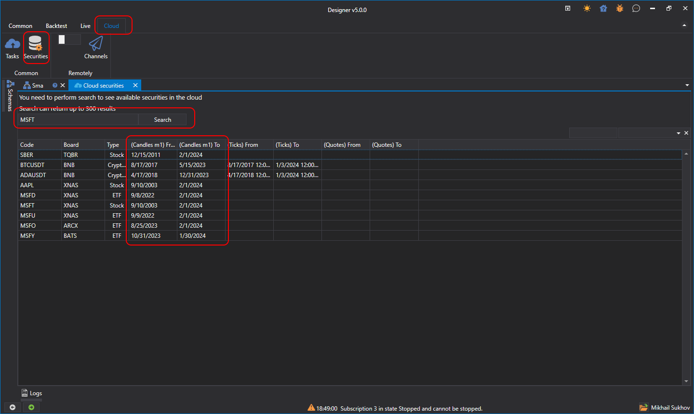

# Cloud-Tests

Um Strategien in der Cloud zu testen, müssen Sie zunächst alle gewünschten Instrumente finden. Öffnen Sie dazu im **Designer** im Tab **Cloud** das Suchfenster für Instrumente, die für Tests verfügbar sind:

Wenn Sie den Namen des Instruments in das Suchfeld eingeben und auf **Suche** klicken oder **Eingabetaste** drücken, gibt der StockSharp-Server passende Suchergebnisse zurück. Rechts neben den Instrumentnamen werden außerdem die Datumsbereiche der historischen Daten angezeigt.

Dieser Vorgang muss für jedes neue Instrument nur einmal durchgeführt werden. Danach werden die gefundenen Instrumente lokal auf der Festplatte gespeichert und beim Neustart des **Designer** bereits aus dem lokalen Speicher geladen. Dieser Schritt ist erforderlich, weil beim Starten der Strategie ein Instrument angegeben werden muss, ebenso wie bei der direkten Angabe von Instrumenten im Block [Variable](../strategies/using_visual_designer/elements/data_sources/variable.md).

Danach müssen Sie zur Strategie zurückkehren und im Tab **Rücktest** die Cloud-Option aktivieren:

Beim Start des Tests wird die Strategie an die StockSharp-Cloud gesendet, statt lokal getestet zu werden:

Nach Abschluss der Tests wird der Bericht mit den Ergebnissen im Tab der wartenden Aufgaben angezeigt:

Wenn Sie die Historie der Cloud-Tests sowie die aktuell aktiven Aufgaben anzeigen möchten, öffnen Sie im Tab **Cloud** das Panel **Aufgaben**:

