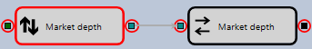

# Haltepunkte

Um einen Haltepunkt hinzuzufügen, wählen Sie den Würfel aus und klicken Sie auf die Schaltfläche **Add Breakpoint**. Haltepunkte werden mit einem roten Kreis hervorgehoben:

Wenn der Haltepunkt an einem Element ausgelöst wird, ändert sich dessen Hintergrund in Hellrot.
Das Element wird automatisch im Eigenschaftenfenster markiert, in dem seine Eigenschaften sowie die Werte der Eingabe- und Ausgabeparameter angezeigt werden.
Wenn Sie mit der Maus auf einen Eingabe- oder Ausgabeparameter zeigen, erscheint ein Hinweis mit dem Parameterwert.
Ein Beispiel für die Anzeige der Werte am Ein- und Ausgang eines zusammengesetzten Elements während der Strategieausführung zeigt die folgende Abbildung:

Haltepunkte können sowohl vor dem Start des Testprozesses als auch während des Testings der Strategie auf historischen Daten hinzugefügt werden.

Wenn Sie auf die Schaltfläche **Breakpoints** klicken, erscheint ein Fenster, in dem alle Haltepunkte angezeigt werden. Für jeden Haltepunkt kann eine zusätzliche Auslösebedingung festgelegt werden. Beispielsweise können Sie für ein logisches Signal den Wert **True** festlegen. In diesem Fall hält der Haltepunkt nur an, wenn der Signalwert **True** ist.

## Empfohlene Inhalte

[Schrittweise Ausführung](step_by_step_execution.md)

