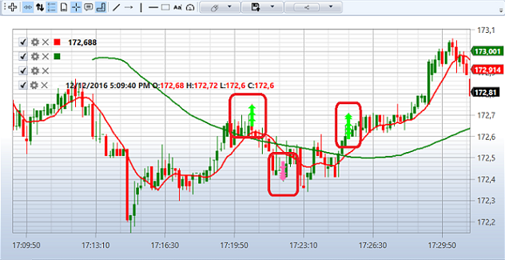

# Erste Schritte

Als Beispiel wird die SMA-Strategie betrachtet.

Um den Test auf historischen Daten auszuführen, wählen Sie eine Strategie aus, deren Schema auf der Historie getestet werden soll. Die Strategie wird im Panel [Schemata](../user_interface/schemas.md) im Strategieordner durch Doppelklick auf die gewünschte Strategie ausgewählt.

Laden Sie vor dem Testing Marktdaten (Instrumente, Kerzen, Tick-Trades und/oder Orderbücher). Dies wird im Abschnitt [Marktdatenspeicher](../market_data_storage.md) beschrieben.

Beim Wechsel in den Tab mit der Strategie wird im **Menüband** automatisch der Tab **Simulation** geöffnet. Legen Sie in diesem Tab den Testzeitraum fest. Geben Sie im Marktdatenfeld den erforderlichen Speicher an ([Marktdatenspeicher](../market_data_storage.md)); geben Sie im Instrumentfeld das erforderliche Instrument an.

Im Beispiel mit der SMA-Strategie werden die folgenden Parameter verwendet.

1. Instrument AAPL@NASDAQ
2. Standardspeicher \\Documents\\StockSharp\\Designer\\Storage
3. Speicherformat - CSV
4. Datentyp aus dem Speicher - Ticks
5. Orderbuch - generiert
6. Orderbuchtiefe - 5
7. Spread-Größe - 2
8. Kerzen mit einem Zeitrahmen von 30 s
9. Volumen - 100

Die ausgewählten Parameter müssen eingerichtet werden:

Nachdem alle erforderlichen Parameter eingerichtet wurden, starten Sie das Strategietesting durch Klicken auf die Schaltfläche .

Während oder nach dem Testing können Sie Charts und Tabellen mit Testinformationen anzeigen.

Der Chart zeigt, dass die Trades wie von der Strategie vorgesehen an den Schnittpunkten der gleitenden Durchschnitte stattfinden. Außerdem ist zu sehen, dass Orders über mehrere Trades ausgeführt werden. Dies geschieht durch die Verwendung eines generierten Orderbuchs, das die Realitätsnähe des Testings erhöht. Dass Orders über mehrere Trades ausgeführt werden, ist in den Tabellen Trades und Statistics sowie im Positions-Chart zu sehen.

Im **Positionsdiagramm** ist zu sehen, dass die Strategie das gehandelte Volumen verringert hat. Dies geschah, weil das generierte Orderbuch eine Tiefe von 5 hat und die gesamte Orderbuchtiefe dadurch nicht ausreichte, um die Order über 200 Lots auszuführen. Da die Strategie lediglich die Position umkehrt, wurde die Ordergröße jedes Mal reduziert, wenn die Orderbuchtiefe für die Orderausführung nicht ausreichte.

Der **P\/L**-Chart zeigt, dass die Strategie mit diesen Parametern unprofitabel ist.

## Empfohlene Inhalte

[Live-Ausführung](../live_execution/getting_started.md)
