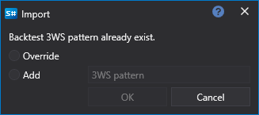

# Import

Der Designer ermöglicht den Import jeder Art von Daten: Strategien, Blöcke und Indikatoren. Es gibt mehrere Möglichkeiten zum Import:

- Klicken Sie im Panel **Schemata** mit der rechten Maustaste auf den Strategieordner und wählen Sie im erscheinenden Menü **Importieren**.
- Drücken Sie im Tab **Allgemein** die Schaltfläche **Importieren** und wählen Sie im erscheinenden Menü **Strategie**, **Eigenes Element** oder **Indikator**:

Wenn bereits Daten mit demselben Namen vorhanden sind, erscheint ein Fenster, das anbietet, sie zu überschreiben oder unter anderem Namen hinzuzufügen:

