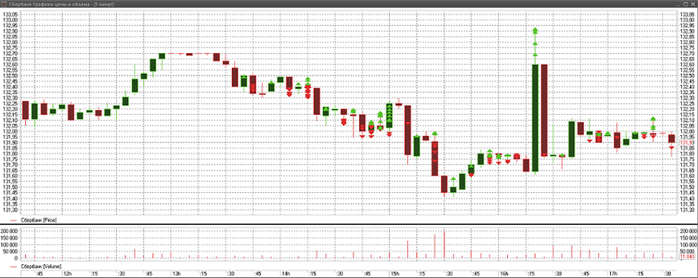

# Beispiel für Live-Ausführung

Um ein Beispiel in **Live-Handel** auszuführen, benötigen Sie:

1. Das Testterminal **IB Trader Workstation (TWS) Demo** von [Interactive Brokers](../../api/connectors/stock_market/interactive_brokers.md), das Sie auf der Website des Herstellers erhalten.

2. Richten Sie das Terminal IB TWS Demo für die Arbeit mit [Designer](../../designer.md) ein. Siehe **IB TWS-Einstellungsbeispiel** im Abschnitt [Interactive Brokers](../../api/connectors/stock_market/interactive_brokers.md).

3. Richten Sie die Verbindung zu IB TWS Demo in [Designer](../../designer.md) ein und verbinden Sie sich.

4. Laden Sie die Historie für das erforderliche Instrument herunter. In diesem Beispiel wird das Instrument **AAPL@NASDAQ** verwendet. Die Strategie verwendet Kerzen mit einem Zeitrahmen von 5 Sekunden; die Historie wird nicht benötigt, reicht aber aus, um die Möglichkeit zu demonstrieren.

5. Richten Sie die Strategie ein und starten Sie sie.

Im Beispiel mit der SMA-Strategie werden die folgenden Parameter verwendet.

- Instrument **AAPL@NASDAQ**
- Standardspeicher **\\Documents\\StockSharp\\Designer\\Storage**
- Speicherformat - **CSV**
- Datentyp aus dem Speicher - **Ticks**
- Kerzen mit einem Zeitrahmen von 5 s
- Volumen - 100
- Historientage - 2

Nachdem alle erforderlichen Parameter eingerichtet wurden, starten Sie den Live-Handel für die Strategie, indem Sie auf die Schaltfläche  Start klicken.

Nach dem Klicken auf die Schaltfläche  Start beginnt der Chart, die gesamte heruntergeladene Historie für 2 Tage anzuzeigen:

Nachdem die gesamte Historie aus dem [Marktdatenspeicher](../market_data_storage.md) und die Tabelle der anonymen Trades aus dem Terminal geladen wurden, beginnt die Strategie zu handeln.

Unten sehen Sie Charts aus [Designer](../../designer.md) und dem Handelsterminal für denselben Zeitraum.

Chart aus [Designer](../../designer.md):

Chart aus dem Handelsterminal:

## Siehe auch

[Marktdatenspeicher](../market_data_storage.md)
