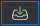
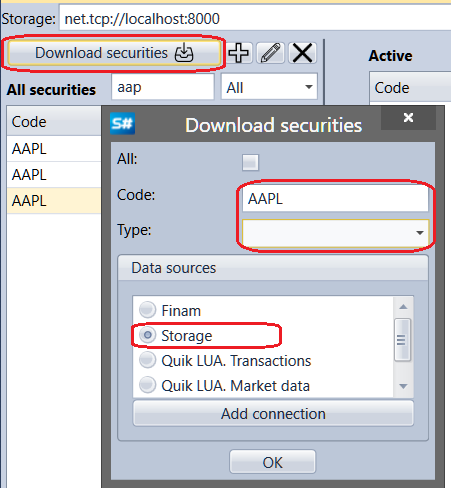

# Instrumente herunterladen

Ein Klick auf die Schaltfläche **Download securities**  öffnet das Fenster **Download securities**. Um ein Instrument herunterzuladen, geben Sie den Instrumentcode ein oder wählen das Flag **All**, wählen die Datenquelle aus und klicken auf **OK**. [Designer](../../designer.md) beginnt mit der Suche nach Instrumenten in der ausgewählten Quelle. Alle gefundenen Instrumente werden der Instrumentliste im Panel **All securities** hinzugefügt. Wenn Storage als Quelle ausgewählt ist und bereits heruntergeladene Instrumente enthält, findet [Designer](../../designer.md) alle in diesem Speicher verfügbaren Instrumente. Das kann nützlich sein, wenn die Historie für ein Instrument bereits heruntergeladen und in den Speicherordner kopiert wurde. Standardmäßig verwendet [Designer](../../designer.md) seinen eigenen Speicher. Wenn Sie Daten in einem anderen Ordner gespeichert haben, achten Sie daher auf den Speicherpfad und das Datenformat (bin oder csv).

Ein Klick auf die Schaltfläche **Add connection** öffnet das Fenster [Verbindungseinstellungen](../connections_settings.md).

## Siehe auch

[Instrument erstellen](create_instrument.md)

