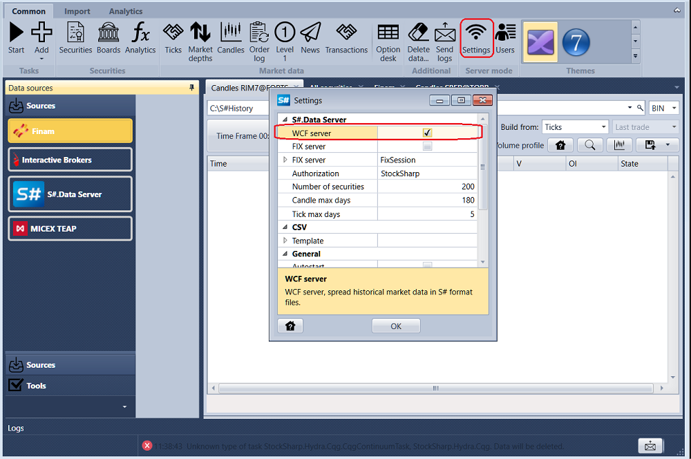
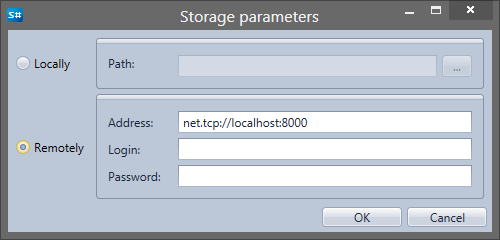

# Erste Schritte

Um einen Speicher für historische Daten zu erstellen, klicken Sie im Tab **Marktdaten** auf die Schaltfläche . Klicken Sie auf , um die aktuellen Speicherparameter zu ändern. Klicken Sie auf , um den aktuellen Speicher aus der Liste der Speicher zu löschen.

Der Speicher für historische Daten kann lokal oder remote sein.

Lokaler Speicher - alle Daten werden auf dem lokalen Computer gespeichert. Um lokalen Speicher einzurichten, reicht es aus, den Pfad zum Ordner mit den gespeicherten Daten anzugeben.

Remote-Speicher kann sich auf einem anderen Computer befinden. Zur Konfiguration geben Sie die Adresse des Remote-Speichers sowie bei Bedarf Login und Passwort an.

Sie können den Remote-Speicher auf einem lokalen Computer reproduzieren, indem Sie die Software [Hydra](../../hydra.md) (Codename Hydra) verwenden. Sie ist für das automatische Laden von Marktdaten (Instrumente, Kerzen, Tick-Trades, Orderbücher usw.) aus verschiedenen Quellen und deren Speicherung im lokalen Speicher ausgelegt. Schalten Sie [Hydra](../../hydra.md) dazu in den Servermodus.

Erstellen Sie danach in [Designer](../../designer.md) einen neuen Speicher, indem Sie auf die Schaltfläche  klicken. Geben Sie in den Speichereinstellungen im Adressfeld "net.tcp:\/\/localhost:8000" an. Klicken Sie auf OK. Wenn Sie [Hydra](../../hydra.md) als Remote-Speicher verwenden, vergessen Sie nicht, dass [Hydra](../../hydra.md) gestartet und entsprechend konfiguriert sein muss.

Nachdem ein neuer Speicher hinzugefügt wurde, kann er in der Dropdown-Liste **Speicher** ausgewählt werden.

Außerdem müssen Sie das Format der Speicherdateien auswählen: BIN oder CSV. Daten können in zwei Formaten gespeichert werden: im speziellen binären BIN-Format, das die maximale Komprimierung bietet, oder im Textformat CSV, das für die Datenanalyse in anderen Programmen praktisch ist. Das BIN-Format ist vorzuziehen, wenn Speicherplatz gespart werden muss. Das CSV-Format ist vorzuziehen, wenn Daten manuell angepasst werden müssen. CSV lässt sich leicht mit Standard-Notepad, MS Excel usw. bearbeiten.

## Empfohlene Inhalte

[Instrumente herunterladen](download_instruments.md)
