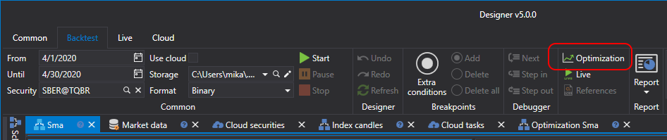

# Brute-Force-Optimierung

Um in den Strategieoptimierungsmodus zu wechseln, klicken Sie im Tab **Simulation** auf die Schaltfläche **Optimierung**. Das Optimierungsbeispiel wird anhand der SMA-Strategie betrachtet, die [aus Würfeln](../strategies/using_visual_designer/first_strategy.md) erstellt wurde.

Im Arbeitsbereich wird ein Tab mit dem Namen Optimierung + 'Strategiename' geöffnet. Der Tab **Optimierung** ist in zwei Bereiche unterteilt: **Eigenschaften** und **Optimierungsergebnis**:

- Der Bereich **Eigenschaften** besteht aus Tabs mit mehreren Tabellen. Die erste Tabelle enthält die Strategieparameter, die [durchlaufen](optimization_parameters.md) werden. Die zweite enthält Einstellungen für [Genetik](genetic.md). Die dritte enthält Systemeinstellungen des Optimierers. Dort können Sie zum Beispiel die Anzahl der Threads und Kerne ändern, die an der Optimierung beteiligt sind.
- Der Bereich **Optimierungsergebnis** ist eine Tabelle, in der jede Zeile das Ergebnis des Testings der Strategie mit eindeutigen Parametern darstellt. Außerdem enthält der Bereich **Optimierungsergebnis** eine Fortschrittsanzeige, die den Optimierungsfortschritt, die verstrichene Zeit und die geschätzte Zeit bis zum Ende der Optimierung anzeigt. Zusätzlich gibt es einen Tab zur Anzeige der Ergebnisse als [3D-Chart](3d_chart.md).

Das Festlegen der Parameter für die Iteration führt zu mehr als 1000 Iterationen. Nach dem Start des Optimierers zeigt der Fortschritt oben über den Ergebnissen Daten zur geplanten Anzahl von Iterationen, zur bereits abgeschlossenen Anzahl und zur ungefähr benötigten Zeit bis zum Abschluss:

## Siehe auch

[Rücktestbeispiel](../backtesting/getting_started.md)

