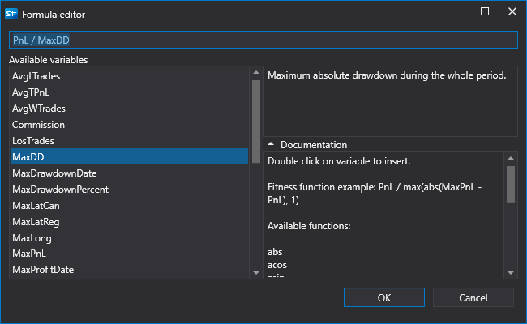

# Genetik

Der **Designer** unterstützt Optimierung sowohl mit der [Brute-Force-Methode](brute_force.md) als auch auf Basis genetischer Algorithmen. Genetische Optimierung beschleunigt den Prozess zum Finden optimaler Parameter erheblich.

Um die **Genetic**-Optimierung zu aktivieren, müssen Sie:

- den Modus wechseln:

  

- die Optimierungsparameter festlegen:

  

- als Zielfunktion (Fitness) können Sie eine erweiterte Formel angeben:

  

  Beispielsweise können Berechnungen nicht nur nach **Profit**, sondern auch relativ zu dessen **Maximum Drawdown** durchgeführt werden. Verfügbare mathematische Funktionen sind ähnlich wie im Block [Formel](../strategies/using_visual_designer/elements/common/formula.md).

> [!TIP]
> Optimierung über Genetik ist nicht deterministisch. Daher ist es anders als bei der [Brute-Force-Suche](brute_force.md) unmöglich, die genaue Anzahl der Iterationen und damit die erforderliche Gesamtzeit zu bestimmen.

