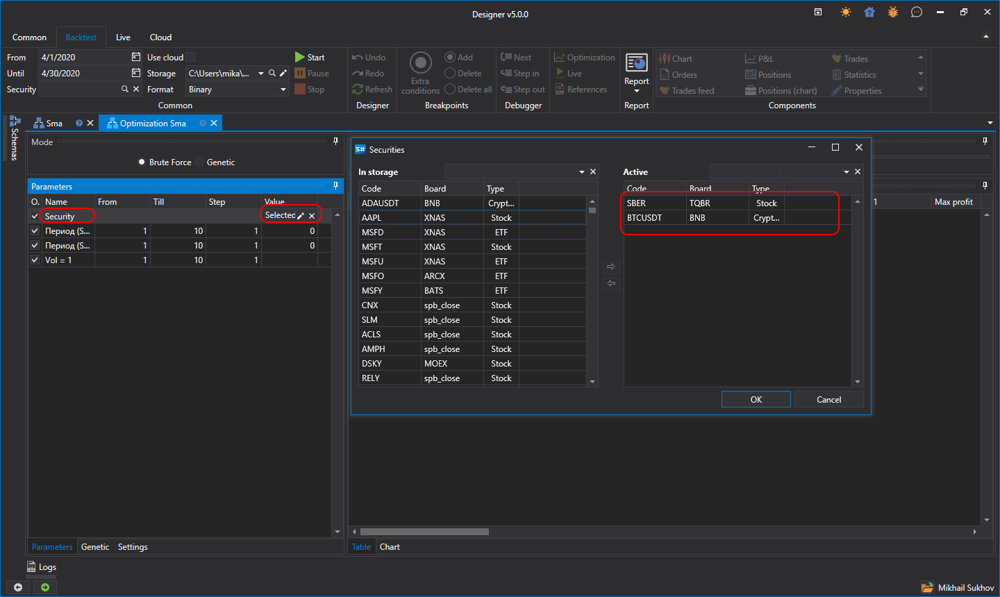

# Portfoliooptimierung

Der [Designer](../../designer.md) kann eine Strategie gleichzeitig auf verschiedenen Instrumenten testen. Klicken Sie dazu auf die Schaltfläche [Optimization](brute_force.md).

Legen Sie in den Optimierungsparametern den Parameter **Handelsinstrument** fest und wählen Sie aus der Liste die Instrumente aus, für die Sie das Testing durchführen möchten. Legen Sie im **Menüband** den Testzeitraum und den Marktdatenspeicher fest. Nach dem Klicken auf die Schaltfläche **Starten** beginnt das Testing gleichzeitig für alle Instrumente.
