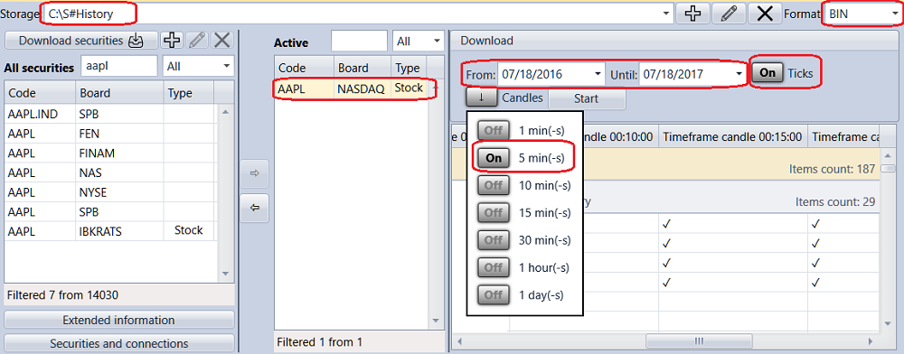

# Schnellstart

Beim ersten Start öffnet [Designer](../designer.md) das vorkonfigurierte Strategiediagramm mit gleitenden Durchschnitten.

Um es auf historischen Daten auszuführen, müssen Sie die Daten im richtigen Format herunterladen. Wir empfehlen [Hydra](../hydra.md), ein Programm zum automatischen Laden von Marktdaten (Instrumente, Kerzen, Tick-Trades, Orderbücher und andere Daten) aus verschiedenen Quellen und zum Speichern dieser Daten im lokalen Speicher. Der Download und die Speicherung historischer Daten werden ausführlich im Abschnitt [Marktdatenspeicher](market_data_storage.md) beschrieben.

Nachdem die Daten mit [Hydra](../hydra.md) heruntergeladen wurden, geben Sie in [Designer](../designer.md) das Verzeichnis an, in dem [Hydra](../hydra.md) die Historie gespeichert hat. Dies wird im Tab **Rücktest** -> **Speicher** konfiguriert.

Ein Klick auf  öffnet das Fenster **Datenspeichereinstellungen**, in dem Sie lokalen oder entfernten Speicher konfigurieren können. Sie können [Hydra](../hydra.md) auch [im Servermodus](../hydra/server_mode/settings.md) als Marktdatenquelle konfigurieren. Ein Klick auf die **Repository-Schaltfläche** öffnet das Fenster zur Ordnerauswahl. Wählen Sie den Ordner aus, in dem Sie zuvor die von [Hydra](../hydra.md) heruntergeladene Historie gespeichert haben.

Rufen Sie nun die Instrumente und ihre Daten aus dem konfigurierten lokalen Speicher ab. Wechseln Sie zum Tab **Allgemein** und wählen Sie die Komponente **Marktdaten**.

Der Tab zur Marktdatenverwaltung wird geöffnet. Um die verfügbaren Instrumente abzurufen, klicken Sie auf [Instrumente herunterladen](market_data_storage/download_instruments.md). Um ein Instrument herunterzuladen, geben Sie dessen Code ein oder wählen das Flag **Alle**, wählen die Datenquelle aus und klicken auf **OK**. [Designer](../designer.md) fragt die verfügbaren Instrumente bei der Datenquelle ab. Alle gefundenen Instrumente erscheinen im Panel **Alle Instrumente**.

Jetzt kann [Designer](../designer.md) die heruntergeladenen Instrumente und die im Speicher verfügbaren historischen Daten verwenden. Wählen Sie eine der Demostrategien. Öffnen Sie im Panel [Schemata](user_interface/schemas.md) den Ordner **Strategien** und doppelklicken Sie auf die Beispielstrategie **SMA**. Im Arbeitsbereich erscheint der Tab **Sma**. Nach dem Wechsel zur Strategie öffnet das Menüband automatisch den Tab **Rücktest**, der die wichtigsten Steuerelemente zum Erstellen, Debuggen und Testen von Strategien enthält ([Strategien erstellen](strategies/using_visual_designer.md), [Beispiel für historisches Testing](backtesting/getting_started.md)).

Legen Sie im Tab **Rücktest** den Testzeitraum fest, wählen Sie das Instrument und wählen Sie den [Marktdatenspeicher](market_data_storage.md).

Ein Klick auf  im Feld **Handelsinstrument** öffnet das Fenster **Instrument auswählen**. Wählen Sie in diesem Fenster das erforderliche Instrument aus.

Wenn Sie einen beliebigen Block im Panel **Designer** auswählen, zeigt das Panel **Eigenschaften** die Eigenschaften dieses Blocks an. Im Panel **Eigenschaften** des Blocks **Kerzen** können Sie Kerzentyp und Zeitrahmen konfigurieren ([Kerzen](../api/candles.md)).

Nach dem Klicken auf **Starten** beginnt die Handelsemulation. Die Testergebnisse sind in den entsprechenden Tabs des Diagramms verfügbar: Chart, Orders, Trades, P/L, Positionen (Chart), Statistik und Positionen.

