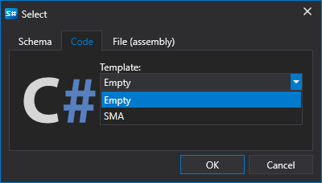

# C# verwenden

Das Erstellen von Strategien aus Code richtet sich an Benutzer, die bevorzugt mit C#-Code arbeiten. Solche Strategien sind im Gegensatz zu Diagrammen nicht in ihren Möglichkeiten eingeschränkt, und jeder Algorithmus kann beschrieben werden.

Der Prozess zum Erstellen einer Strategie findet direkt im [Designer](../../../designer.md) oder in einer **C#**-Entwicklungsumgebung statt (die beliebtesten sind **Visual Studio** und **JetBrains Rider**). Dabei wird eine Bibliothek für die professionelle Entwicklung von Handelsrobotern in **C#** und [API](../../../api.md) verwendet.

Sie können eine neue Strategie hinzufügen, indem Sie im Tab **Allgemein** auf die Schaltfläche **Hinzufügen**  klicken und **Strategie** auswählen. Alternativ klicken Sie mit der rechten Maustaste auf den Ordner **Strategien** im Panel **Schema** und anschließend im Dropdown-Menü auf die Schaltfläche **Hinzufügen** :

Nach dem Klicken auf die Schaltfläche **Hinzufügen**  erscheint ein Fenster, in dem der Inhaltstyp ausgewählt wird, auf dessen Grundlage die Strategie erstellt werden soll:

Um eine Strategie aus C#-Code zu erstellen, müssen Sie den zweiten Tab auswählen. Sie können außerdem eine Vorlage auswählen, die als Anfangscode verwendet wird.

Nach dem Klicken auf **OK** erscheint eine neue Strategie im Ordner **Strategien** des Panels **Schema**, ähnlich wie beim Erstellen einer Strategie aus [Diagrammen](../using_visual_designer.md). Auch die Aktionen zum Löschen oder Umbenennen der Strategie sind ähnlich.

Anstelle eines Diagramms wird jedoch ein C#-Code-Editor angezeigt:

Der Code-Editor-Tab besteht aus den Panels **Quellcode** und **Fehlerliste**. Das Panel **Quellcode** enthält den eigentlichen C#-Code-Editor. Oben befindet sich eine Symbolleiste, in der Hervorhebungen wie **Aktuelle Zeile**, **Zeilennummer** usw. ein- oder ausgeschaltet werden können. Um die Schriftgröße zu erhöhen, können Sie die Kombination CTRL+MouseWheel verwenden.

Das Panel **Fehlerliste** ist eine Tabelle mit einer Liste der Fehler im Code. Ein Doppelklick auf eine Zeile bewegt den Cursor im Panel **Quellcode** automatisch an die Fehlerstelle.

Beim Bearbeiten des Codes erscheint in der rechten unteren Ecke des Panels **Fehlerliste** ein Symbol , das anzeigt, dass die Änderungsverfolgung begonnen hat. Der Code wird kompiliert, sobald sich der Code nicht mehr ändert.

Das Ausführen der Strategie im [Rücktest](../../backtesting/user_interface.md), im [Live-Betrieb](../../live_execution/getting_started.md) und andere Operationen funktionieren ähnlich wie bei einer Strategie aus Diagrammen.
