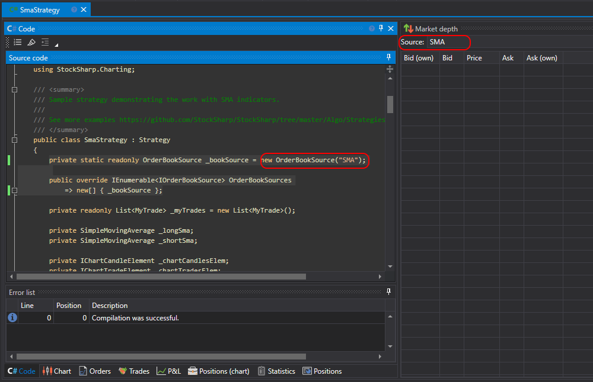

# Orderbuch zeichnen

Eine Strategie aus Code kann Daten im Panel [Orderbuch](../../../user_interface/components/order_book.md) ähnlich wie der Würfel [Orderbuch-Panel](../../using_visual_designer/elements/market_depths/order_book_panel.md) zeichnen. Dafür muss der folgende Code geschrieben werden.

1. Erstellen Sie einen Nachfolger der Schnittstelle [IOrderBookSource](xref:StockSharp.Algo.Strategies.IOrderBookSource), die **Designer** verwendet, um die Quelle zu identifizieren. Im Beispiel wird die Klasse [OrderBookSource](xref:StockSharp.Algo.Strategies.OrderBookSource) verwendet, die die Standardimplementierung der Schnittstelle ist:

```cs
private static readonly OrderBookSource _bookSource = new OrderBookSource("SMA");
```

2. Überschreiben Sie die Eigenschaft [OrderBookSources](xref:StockSharp.Algo.Strategies.Strategy.OrderBookSources):

```cs
public override IEnumerable<IOrderBookSource> OrderBookSources
	=> new[] { _bookSource };
```

Damit teilt die Strategie externem Code, in diesem Fall dem Panel [Orderbuch](../../../user_interface/components/order_book.md), mit, welche Orderbuchquellen verfügbar sind. Mehrere Quellen entstehen, wenn die Strategie mit mehreren Orderbüchern arbeitet, zum Beispiel mit unterschiedlichen Instrumenten oder Orderbüchern mit verschiedenen Modifikationen wie einem [ausgedünnten Orderbuch](../../using_visual_designer/elements/market_depths/sparse_order_book.md).

3. Fügen Sie die Initialisierung des Orderbuch-Abonnements zum Strategiecode hinzu. Im Fall von SmaStrategy wird sie am Ende der Methode [OnStarted](xref:StockSharp.Algo.Strategies.Strategy.OnStarted) hinzugefügt:

```cs
var bookSubscription = new Subscription(DataType.MarketDepth, Security);

bookSubscription
	.WhenOrderBookReceived(this)
	.Do(book =>
	{
		// Orderbuch zeichnen
		DrawOrderBook(bookSubscription, _bookSource, book);
	})
	.Apply(this);

Subscribe(bookSubscription);
```

Im Do-Handler wird die Methode [DrawOrderBook](xref:StockSharp.Algo.Strategies.Strategy.DrawOrderBook(StockSharp.BusinessEntities.Subscription,StockSharp.Algo.Strategies.IOrderBookSource,StockSharp.Messages.IOrderBookMessage)) aufgerufen, die das Orderbuch zum Zeichnen sendet.

4. Fügen Sie das Panel [Orderbuch](../../../user_interface/components/order_book.md) hinzu und wählen Sie die im Code erstellte Quelle aus:

  

5. Nach dem Start der Strategie zum Testing wird das Orderbuch mit Daten gefüllt:

  

