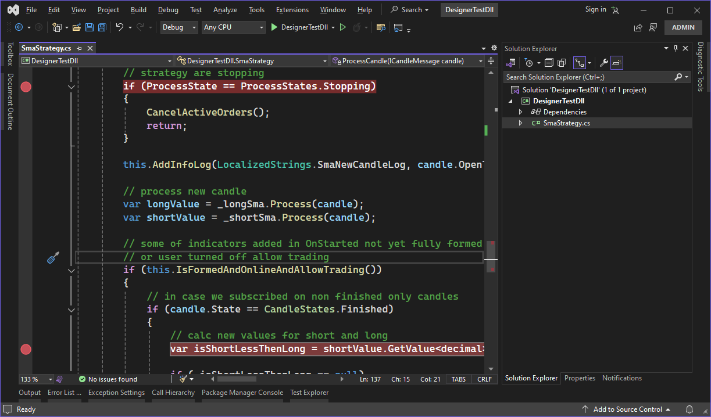
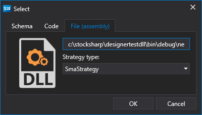
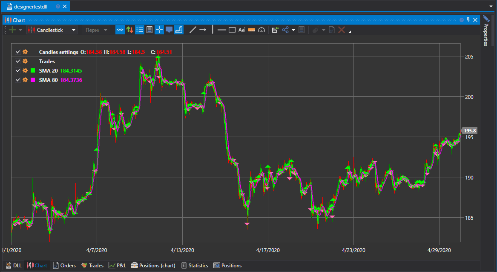

# DLL verwenden

Die Verwendung fertiger DLLs ist für Benutzer vertraut, die kontinuierlich in den Umgebungen **Visual Studio** und **JetBrains Rider** arbeiten möchten. Dieser Ansatz bietet mehrere Vorteile gegenüber dem Schreiben von [Code](using_code.md) innerhalb von **Designer**:

- Erweiterter Code-Editor im Vergleich zum integrierten Editor in **Designer**.
- Beim Neukompilieren des Codes werden Inhalte in **Designer** automatisch aktualisiert.
- Möglichkeit, Code auf mehrere Dateien aufzuteilen (beim Ansatz mit [Code](using_code.md) ist nur die Variante OneFile-OneStrategy möglich).
- Verwendung des [Debuggers](using_dll/debug_dll_in_visual_studio.md).

### Projekt in Visual Studio erstellen

1. Um eine Strategie in **Visual Studio** zu erstellen, müssen Sie ein Projekt anlegen:

2. Anschließend müssen Sie den Strategiecode schreiben. Für einen schnellen Start können Sie den SmaStrategy-Code kopieren, der als Vorlage in [Strategie aus Code](using_code/csharp/first_strategy.md) erstellt wird:

3. Um den Code zu kompilieren, binden Sie das NuGet-Paket [StockSharp.Algo](https://www.nuget.org/packages/stocksharp.algo) ein, das die Basisklasse für alle Strategien enthält: [Strategy](xref:StockSharp.Algo.Strategies.Strategy).

Wenn die Strategie Charting-Schnittstellen verwendet, binden Sie das NuGet-Paket [StockSharp.Charting.Interfaces](https://www.nuget.org/packages/stockSharp.charting.interfaces) ein. Diese Schnittstellen enthalten keine eigentliche Chartlogik und werden nur benötigt, um den Code zu kompilieren. Wenn die Strategie in **Designer** läuft, erfolgt die reale Chartdarstellung über diese Schnittstellen.

4. Nach dem Erstellen der Strategie muss das Projekt gebaut werden, indem Sie im Tab **Build** auf **Build Solution** klicken.

5. Standardmäßig wird das Projekt in Visual Studio in den Ordner …\\bin\\Debug\\net6.0 gebaut.

### DLL zu Designer hinzufügen

1. Das Hinzufügen einer Strategie aus einer DLL ähnelt dem Erstellen einer Strategie aus [Code](using_code.md). In der Phase zur Definition des Inhaltstyps müssen Sie jedoch **DLL** auswählen:

2. Im Fenster müssen Sie den Pfad zur Assembly angeben (sie muss mit .NET 6.0 kompatibel sein) und den Typ auswählen. Letzteres ist erforderlich, weil eine DLL mehrere Strategien (oder [Würfel mit Indikatoren](using_dll/create_element_and_indicator.md)) enthalten kann. Nach dem Klicken auf **OK** wird die Strategie zum Panel **Scheme** hinzugefügt und ist einsatzbereit:

3. Das Starten der Strategie im [Backtest](../backtesting/user_interface.md), im [Live-Betrieb](../live_execution/getting_started.md) und andere Operationen funktionieren ähnlich wie bei einer Strategie aus Diagrammen und Code:

