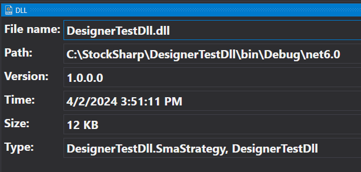

# DLL-Panel

Das DLL-Panel zeigt die Metainformationen einer .NET-Assembly an:

Im Panel sehen Sie die Erstellungszeit der Datei, ihre Version und ihren Pfad. Die Erstellungszeit ist die einfachste Möglichkeit festzustellen, welche Assembly-Version von **Designer** verwendet wird.

Beim Neukompilieren der Assembly über ein [externes Programm](create_element_and_indicator.md) werden die Metadaten automatisch aktualisiert.

