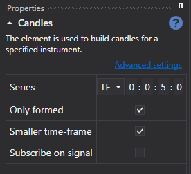

# Strategie-Designer

Der Hauptprozess zum Entwerfen einer Strategie und ihrer Komponentenelemente findet im Panel **Schema** statt, indem Blöcke kombiniert und mit Linien verbunden werden. Das Panel Schema besteht aus den Panels **Elemente-Palette**, **Designer** und **Eigenschaften**.

## Palette-Panel

Das Panel **Elemente-Palette** enthält Blöcke, aus denen Strategien erstellt werden. Alle Elemente in der Palette sind in Kategorien unterteilt, die im Abschnitt [Beschreibung der Blöcke](elements.md) beschrieben werden. Um einen Block zum Panel **Designer** hinzuzufügen, klicken Sie mit der rechten Maustaste auf den gewünschten Block und ziehen ihn bei gedrückter Taste in das Panel **Designer**. Danach wird das Element automatisch ausgewählt, und seine Parameter werden im Fenster zur Bearbeitung der Blockeigenschaften angezeigt.

## Designer-Panel

Das Panel **Designer** ist der Bereich, in dem der gesamte Prozess zum Erstellen einer Strategie durch Kombinieren von Blöcken und Verbindungen (Linien) erfolgt. Es stellt das Strategieschema visuell dar. Ausführliche Informationen zum Erstellen einer Strategie finden Sie im Abschnitt [Algorithmus aus Blöcken erstellen](first_strategy.md).

## Eigenschaften-Panel

Das Panel **Eigenschaften** zeigt die Parameter des auf dem Panel **Designer** ausgewählten Blocks an. Wenn ein Block im Panel **Designer** ausgewählt ist, wird sein Rahmen schwarz eingefärbt.

Das Panel **Eigenschaften** kann in zwei Modi angezeigt werden: *Basiseinstellungen* und *Erweiterte Einstellungen*.

Standardmäßig werden die Eigenschaften beim Erstellen eines Schemas zunächst im Modus *Basiseinstellungen* angezeigt. Um in den Modus *Erweiterte Einstellungen* zu wechseln, müssen Sie auf die entsprechende Überschrift klicken.

Im Modus *Basiseinstellungen* werden nur die wichtigsten Eigenschaften des Blocks angezeigt. Für den Block [Kerzen](elements/data_sources/candles.md) werden beispielsweise der Zeitrahmen, das Flag zum Empfangen nur gebildeter Kerzen, das Flag für die Möglichkeit, Kerzen aus einem kleineren Zeitrahmen zu bilden, und das Flag zum Abonnieren von Kerzen per Signal angezeigt.

Im Modus *Erweiterte Einstellungen* werden alle änderbaren und konfigurierbaren Eigenschaften des Blocks angezeigt.

Alle Blöcke enthalten einen Satz vordefinierter Eigenschaften, die im Modus *Erweiterte Einstellungen* sichtbar werden:

- **Name** – der Name des Elements, der im Designer angezeigt wird.
- **Protokollierungsstufe** – die Protokollierungsstufe für dieses Element.
- **Parameter** – Parameter des Elements in übergeordneten Elementen anzeigen.
- **Anschlüsse** – Sockets des Elements in übergeordneten Elementen anzeigen.

Ausführliche Informationen zu den Eigenschaften jedes Blocks finden Sie im Abschnitt [Beschreibung der Blöcke](elements.md).

## Siehe auch

[Beschreibung der Blöcke](elements.md)

