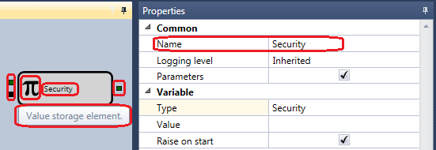

# Elemente

In jedem Würfel wird ein Symbol angezeigt, das ihn charakterisiert, sowie ein Name, der im Panel **Eigenschaften** in einen benutzerdefinierten Namen geändert werden kann. Ein Tooltip für den Würfel zeigt eine Beschreibung, wofür dieser Würfel vorgesehen ist. Wenn Sie einen Würfel mit der Maus auswählen, können Sie seine Eigenschaften im Panel **Eigenschaften** anzeigen und bei Bedarf einige Parameter ändern.

Links und rechts vom Würfel zeigen farbige Kästchen die eingehenden (links) und ausgehenden (rechts) Parameter.

Parameter werden benötigt, um den Würfel während der Ausführung der Strategie mit Informationen zu füllen. Zum Beispiel wird beim Würfel [Kerzen](elements/data_sources/candles.md) das Instrument, für das eine Kerze erstellt werden soll, an den Eingang übergeben; die erstellten Kerzen werden am Ausgang zurückgegeben. Diese können wiederum als Eingabeparameter für das Element [Chart](elements/common/chart.md) verwendet oder an eine Methode übergeben werden, die die Kerzengröße bestimmt.

Die Farbe bezeichnet den Datentyp, der in den Parametern übergeben wird. Unterschiedliche Parameter in unterschiedlichen Würfeln können unterschiedliche und inkompatible Datentypen empfangen und weitergeben. Die Beschreibung jedes Parameters wird im Tooltip angezeigt. Um viele Fehler beim Verbinden von Parametern unterschiedlicher Typen zu vermeiden, hat jeder Parameter einen eigenen Datentyp, der sich durch seine Farbe unterscheidet. Die folgende Farbpalette wird zur Kennzeichnung der Parameter verwendet:

- **Black** - beliebiger Datentyp, normalerweise als Signal zum Ausführen bestimmter Aktionen innerhalb des Elements verwendet.
- **Dark green** - das Instrument.
- **Dark cyan** - das Orderbuch.
- **Cyan** - die Quote (ein Paar aus Preis und Volumen).
- **Orange red** - Kerzen und Kerzenstatus.
- **Dark goldenrod** - der Indikatorwert.
- **Olive** - die Order.
- **Pale violet red** - Orderfehler.
- **Dark olive green** - eigener Trade.
- **Dodger blue** - der Flagwert (zeigt den Zustand an und hat zwei Werte: oben (true) und unten (false)).
- **Medium sea green** - ein numerischer Wert, der als Zahl oder Prozentwert gesetzt werden kann.
- **Dark slate blue** - Werte, die verglichen werden können (zum Beispiel ein numerischer Wert, eine Zeichenfolge, ein Indikatorwert usw.).
- **Brown** - das Portfolio.
- **Deep pink** - Optionen.
- **Beige** - die Seite.
- **Dark khaki** - der Trade.
- **Dark blue** - die Strategie.
- **Chocolate** - das Datum.
- **Coral** - die Uhrzeit.
- **Saddle brown** - die Position.
- **Chartreuse** - der Orderstatus.
- **Gainsboro** - das Black-Scholes-Modell.
- **Tan** - das Basket-Black-Scholes-Modell.
- **Purple** - die Textzeichenfolge.

Somit können Sie Parameter gleicher Farbe (also gleicher Datentypen) verbinden, mit Ausnahme der folgenden Parametertypen:

1. Der Parameter **black** kann beliebige Daten akzeptieren. Meist werden solche Parameter verwendet, um Signale für Aktionen innerhalb des Würfels zu übergeben. Zum Beispiel speichert der Würfel [Variable](elements/data_sources/variable.md) einen bestimmten Wert und sendet ihn an den Ausgang, wenn er ein Signal empfängt.
2. Der Parameter **dark slate blue** kann am Eingang verschiedene vergleichbare Datentypen empfangen. Zum Beispiel numerische Werte, Indikatorwerte, Zeichenfolgen usw.

Es ist zu beachten, dass die Parametertypen von den Eigenschaften des Würfels abhängen können. Zum Beispiel wird beim Würfel [Konverter](elements/converters/converter.md) der Typ des Eingabeparameters automatisch anhand des Datentyps des Datenquellenwürfels für [Konverter](elements/converters/converter.md) bestimmt. Beim Erstellen einer Verbindung ändert sich die Farbe des Quadrats am Element automatisch.

Ausgabeparameter erlauben normalerweise mehrere ausgehende Verbindungen zu unterschiedlichen Würfeln. Eingabeparameter erlauben im Allgemeinen eine Verbindung, mit Ausnahme des Würfels [Kombination](elements/common/combination.md), der das Zusammenführen des Datenstroms aus verschiedenen Würfeln in einen einzigen erlaubt. Die Anzahl gleichzeitiger Verbindungen für einen Parameter ist im Quellcode des Würfels festgelegt.

Würfel zum Erstellen von Schemas sind in mehrere Kategorien unterteilt; jede Kategorie ist für die Verwendung in einem bestimmten Teil des Schemas vorgesehen.

## Empfohlene Inhalte

[Chart](elements/common/chart.md)

