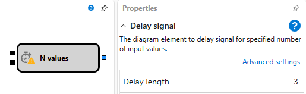

# Wertverzögerung

Diese Komponente wird verwendet, um die Übertragung eines Werts um eine angegebene Anzahl von Iterationen zu verzögern.

## Eingabeanschlüsse

- **Auslöser** – ein Signal (jeder Wert außer `False`), das den internen Zähler initialisiert, um den Verzögerungs-Countdown zu starten.
- **Eingabe** - ein beliebiger eingehender Wert (außer [nicht abgeschlossenen Kerzen](../data_sources/candles.md) oder [nicht finalen Indikatorwerten](indicator.md)), der den internen Zähler verringert. Wenn der Zähler null erreicht, wird er deaktiviert und der ausgehende Anschluss wird aktiviert. Wenn der Zähler nicht durch **Auslöser** aktiviert wurde, werden eingehende Werte ignoriert.

## Ausgabeanschlüsse

- **Signal** – gibt ein Signal aus, wenn der Zähler null erreicht, und zeigt damit das Ende der Verzögerung an.

## Parameter

- **Dauer** - gibt die Verzögerungsdauer in Iterationen an.

## Siehe auch

- [Vergleich](comparison.md)

