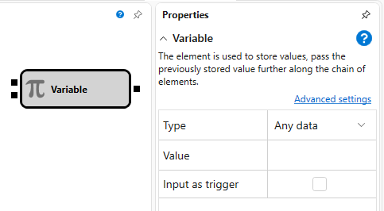

# Variable

Der Würfel wird verwendet, um Werte zu speichern und den zuvor gespeicherten Wert in der Elementkette weiterzugeben.

### Eingehende Sockets

Eingehende Sockets

- **Any data** – der Wert des ausgewählten Typs, der statt des Standardwerts gespeichert wird.
- **Trigger** – das Signal (jeder Wert außer `False`), das den Zeitpunkt bestimmt, zu dem der gespeicherte Wert über den Ausgangs-Socket weitergegeben werden muss.

### Ausgehende Sockets

Ausgehende Sockets

- **Any data** – der Wert des ausgewählten Typs der übergebenen Daten.

### Parameter

Parameter

- **Data type** - der Typ der in der Variablen gespeicherten Daten; der Typ der Eingabe- und Ausgabeparameter hängt vom ausgewählten Datentyp ab.
- **Value** - der Standardwert, der in der Variablen gespeichert ist. Dieser Wert wird verwendet, wenn am Eingang des Elements keine anderen Werte empfangen wurden.
- **Raise on start** - wenn das Kontrollkästchen ausgewählt ist, wird der Wert beim Start der Strategie weitergegeben.

Wenn der Datentyp **Instrument** oder **Portfolio** ausgewählt ist, kann der Standardwert fehlen. In diesem Fall werden diese Daten bei gesetztem Flag **Parameters** in den Eigenschaften während der Strategieausführung aus den entsprechenden Eigenschaften der Strategie entnommen.

## Empfohlene Inhalte

[Indexer](../converters/indexer.md)

