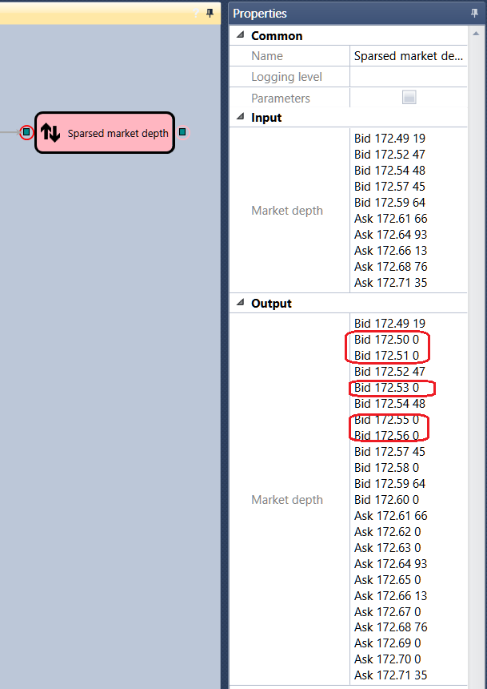

# Ausgedünntes Orderbuch

Der Würfel wird verwendet, um ein ausgedünntes Orderbuch für das angegebene Instrument zu erhalten.

### Eingehende Anschlüsse

- Orderbuch - das Orderbuch, das ausgedünnt werden soll.

### Ausgehende Anschlüsse

- Orderbuch - das ausgedünnte Orderbuch.

### Parameter

- **Preisbereich** - der Preisbereich mit Schritten, nach denen das Orderbuch ausgedünnt wird.

## Empfohlene Inhalte

[IV-Orderbuch](../options/iv_book.md)

