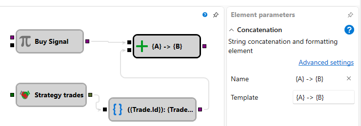

# String concat

Der Würfel verkettet mehrere eingehende Werte anhand einer Vorlage mit Platzhaltern in geschweiften Klammern zu einer einzelnen Textzeichenfolge. Jeder Platzhaltername fügt einen Eingabe-Socket mit demselben Namen hinzu. Verschachtelte Eigenschaften können über Punkte referenziert werden; ein Format kann nach einem Doppelpunkt angegeben werden.

### Eingehende Sockets

Eingehende Sockets

- Werden dynamisch aus den Platzhalternamen erstellt. Jeder Socket akzeptiert Daten beliebigen Typs.

### Ausgehende Sockets

Ausgehende Sockets

- **Text** - die verkettete und formatierte Zeichenfolge.

### Parameter

Parameter

- **Template** - Vorlage für die Zeichenfolgenverkettung und -formatierung. Beim Bearbeiten der Vorlage wird die Liste der Eingabe-Sockets aktualisiert.

### Beispiele

- Die Vorlage `Price: {price:0.00}, Qty: {qty}` mit `price = 10.5` und `qty = 2` erzeugt `Price: 10.50, Qty: 2`.
- Die Vorlage `{time:HH:mm:ss} - {trade.Price}` mit den Sockets `time` und `trade` (`trade.Price = 100`) erzeugt `09:15:00 - 100`.
- Die Vorlage `{side} {volume} @ {trade.Price}` mit den Sockets `side = Buy`, `volume = 1`, `trade.Price = 100` erzeugt `Buy 1 @ 100`.

## Empfohlene Inhalte

[String format](string_format.md)
[Notification](notification.md)

