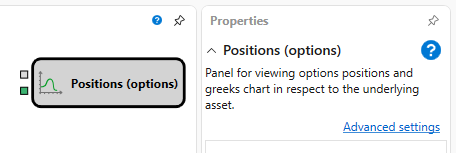

# Chart positions

Der Würfel wird verwendet, um den **Chart of options positions** anzuzeigen.

Um den **Chart of options positions** anzuzeigen, müssen Sie die grafische Komponente **Chart of options positions** hinzufügen.

### Eingehende Sockets

Eingehende Sockets

- **Model** - das Berechnungsmodell (zum Beispiel Black-Scholes).
- **Price of the underlying asset** - der Preis des Basiswerts.

## Empfohlene Inhalte

[Black Scholes](black_scholes.md)

