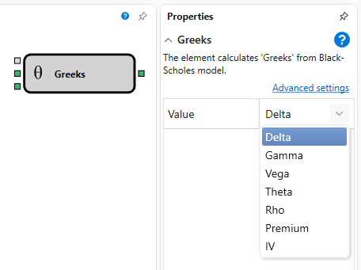

# Griechen

Dieser Block wird verwendet, um die wichtigsten Optionsgriechen zum aktuellen Zeitpunkt zu berechnen: Delta, Gamma, Vega, Theta und Rho.

### Eingehende Anschlüsse

Eingehende Anschlüsse

- **Modell** - das Berechnungsmodell (zum Beispiel Black-Scholes).
- **Preis des Basiswerts** - der Preis des Basiswerts.
- **Maximale Abweichung** - die maximale Abweichung.

### Ausgehende Anschlüsse

Ausgehende Anschlüsse

- **Ergebnis** - das Ergebnis der Berechnung der wichtigsten Optionsgriechen zum aktuellen Zeitpunkt: Delta, Gamma, Vega, Theta und Rho.

### Parameter

Parameter

- **Wert** - kann den Typ eines Optionsgriechen annehmen: Delta, Gamma, Vega, Theta oder Rho. Bestimmt, welcher Wert vom Block ausgegeben wird.

## Siehe auch

[Black-Scholes](black_scholes.md)

