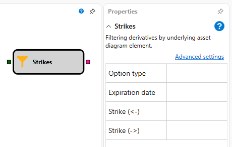

# Ausübungspreise

Der Würfel wird verwendet, um eine Liste von Optionen anhand eines angegebenen Filters zu erhalten.

### Eingehende Anschlüsse

Eingehende Anschlüsse

- **Handelsinstrument** - das Instrument, also der Basiswert.

### Ausgehende Anschlüsse

Ausgehende Anschlüsse

- **Optionen** - die Liste der Optionen auf den Basiswert.

### Parameter

Parameter

- **Optionstyp** - der Optionstyp kann Call-Option oder Put-Option sein.
- **Verfallsdatum** - das Verfallsdatum der Option.
- **Strike (kleiner)** - die Verschiebung nach links (kleiner) vom zentralen Strike. Wenn der Preis nicht gesetzt ist, werden alle Strikes mit einem niedrigeren zentralen Wert verwendet. Die Verschiebung wird in Strike-Schritten berechnet; wenn der Strike-Schritt zum Beispiel 500 c.u. beträgt, entspricht eine Verschiebung von 3 dem Wert 1,500 c.u.
- **Strike (größer)** - die Verschiebung nach rechts (größer) vom zentralen Strike. Wenn der Preis nicht gesetzt ist, werden alle Strikes mit einem höheren zentralen Wert verwendet. Die Verschiebung wird in Strike-Schritten berechnet; wenn der Strike-Schritt zum Beispiel 500 c.u. beträgt, entspricht eine Verschiebung von 3 dem Wert 1,500 c.u.

## Empfohlene Inhalte

[Kreuzung](../common/crossing.md)

