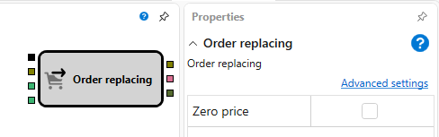

# Orderverschiebung

Dieser Block wird verwendet, um eine Order für ein Instrument zu ändern.

### Eingehende Sockets

Eingehende Sockets

- **Auslöser** - das Signal, das bestimmt, wann eine Order verschoben wird.
- **Auftrag** - die Order, die geändert wird.
- **Preis** - numerischer Wert des neuen Preises.
- **Volumen** - numerischer Wert des neuen Volumens.

### Ausgehende Sockets

Ausgehende Sockets

- **Auftrag** - die geänderte Order, die verwendet werden kann, um über das Element **Transaktionen nach Auftrag** Transaktionen dafür zu erhalten und sie mit dem Block **Diagrammbereich** im Chart anzuzeigen.
- **Fehler** - ein Fehler beim Verschieben der Order.
- **Ausführung** - der Trade für die platzierte Order.

Parameter

- **Nullpreis** - ein Preis von null registriert eine Market-Order.

## Siehe auch

[Orderstornierung](cancel.md)

