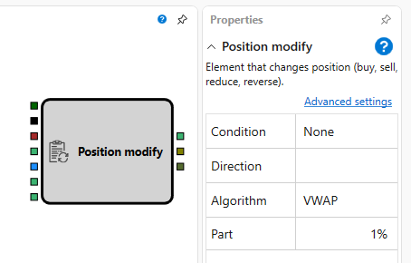

# Modify Position

Die Komponente „Modify Position“ wird verwendet, um eine Handelsposition anhand angegebener Bedingungen zu ändern.

## Eingabe-Sockets

- **Security**: Das Instrument, dessen Position geändert wird.
- **Trigger**: Signal zum Aktivieren der Positionsänderung.
- **Portfolio**: Das Portfolio, in dem der Vorgang ausgeführt wird.
- **Volume** (optional): Das Volumen für die Vorgänge „Increase“ und „Decrease“. Wird für „Reverse“ und „Close Position“ nicht verwendet.
- **Last Price** und **Last Volume**: Für die Algorithmen „VWAP“ und „Iceberg“ sind Daten über den letzten Preis und das letzte Volumen der Transaktion erforderlich.
- **Cancel**: Signal zum Abbrechen der Positionseinrichtung, zum Beispiel wegen eines Timeouts.

## Ausgabe-Sockets

- **Order**: Informationen über die platzierte Order.
- **Transaction**: Informationen über die für die Order ausgeführte Transaktion.
- **Balance**: Dieser Socket überträgt Informationen über den Teil der Position, der am Ende des Positionsänderungsvorgangs nicht realisiert wurde. Der vom Socket zurückgegebene Wert gibt das Ergebnis des Vorgangs an:
  - `0` bedeutet, dass die Komponente den Positionsänderungsvorgang erfolgreich abgeschlossen hat und alle geplanten Aktionen ausgeführt wurden.
  - `-1` gibt an, dass die Komponente die Positionsänderung wegen einer Nichtübereinstimmung zwischen der aktuellen Position und der angegebenen Bedingung nicht gestartet hat (zum Beispiel, wenn die aktuelle Position ungleich null ist und die Bedingung „OpenPosition“ war).
  - Jeder Wert größer als `0` signalisiert, dass der Prozess der Positionsänderung vor Abschluss unterbrochen wurde. Dies kann durch Abbruch über die Schemalogik oder durch einen Fehler bei der Orderregistrierung geschehen.

## Parameter

- **Condition**: Bedingungen für die Positionsänderung:
  - `None`: Führt keine Aktionen aus.
  - `OpenPosition`: Öffnet eine Position in der angegebenen Richtung.
  - `ClosePosition`: Schließt die aktuelle Position.
  - `Decrease`: Verringert die Größe der aktuellen Position.
  - `Increase`: Erhöht die Größe der aktuellen Position.
  - `Reverse`: Schließt die aktuelle Position und öffnet eine neue in entgegengesetzter Richtung.
- **Direction**: Gibt die Richtung für „OpenPosition“ und „None“ an und dient bei anderen Bedingungen als optionaler Filter.
- **Algorithm**: Optionen sind „Market Order“, „VWAP“ und „Iceberg“.
- **Part**: Der Anteil des Gesamtvolumens, der bei Verwendung von Algorithmen wie „VWAP“ oder „Iceberg“ in kleinere Segmente aufgeteilt wird.

Wenn die Komponente einen Trigger empfängt, während sie bereits mit der Änderung des Volumens begonnen hat, ignoriert sie den neuen Trigger. Wenn die Änderungsbedingungen mit dem aktuellen Zustand der Position inkompatibel sind (zum Beispiel beim Versuch, „OpenPosition“ auszuführen, obwohl bereits eine Position geöffnet ist), gibt die Komponente sofort `-1` über den Ausgabe-Socket **Balance** zurück. Dies zeigt an, dass der Vorgang nicht erforderlich ist und nicht gestartet wurde.

## Hinweis

Für die Low-Level-Orderverwaltung kann die Komponente [Order Registration](../orders/register.md) verwendet werden. Für die Positionsverwaltung auf höherer Ebene wird diese Komponente „Modify Position“ empfohlen.

## Siehe auch

- [Order Registration](../orders/register.md)

