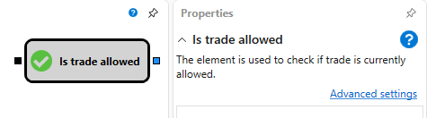

# Is Trading Allowed

Dieser Block wird verwendet, um zu prüfen, ob der Handel aktuell erlaubt ist. Die folgenden Bedingungen werden geprüft:

- Alle Strategie-Abonnements für Marktdaten müssen sich im Zustand [Online](../../../../../api/market_data/subscriptions.md) befinden (Empfang von Echtzeitdaten).
- Alle Indikatoren müssen [formed](../../../../../api/indicators.md) sein.
- Bei [live trading](../../../../live_execution/getting_started.md) muss der eingehende Triggerwert einen Zeitstempel haben, der größer ist als die Startzeit der Strategie.

### Eingehende Sockets

- **Trigger** - das Signal, das bestimmt, wann die Prüfung ausgeführt werden soll.

### Ausgehende Sockets

- **Flag** - ein Flag, das bestimmt, ob die Handelssitzung aktiv ist.

## Siehe auch

[Current Time](current_time.md)

