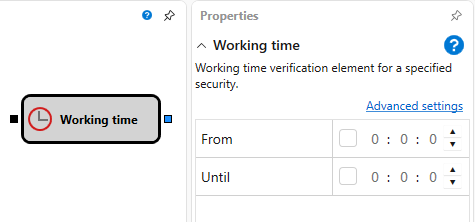

# Arbeitszeit

Dieser Block wird verwendet, um die Arbeitszeit für die Strategie zu bestimmen. Zum Beispiel lässt sich damit festlegen, wann für ein bestimmtes Instrument gehandelt wird oder wann die Strategie handeln darf.
#### Eingehende Sockets

- **Any Data** - der Block akzeptiert jeden Wert, entnimmt ihm aber den Zeitstempel, der anschließend mit den Parametern des Blocks verglichen wird.
#### Ausgehende Sockets

- **Flag** - ein Flag, das bestimmt, ob der Zeitstempel den Parametern des Blocks entspricht (true) oder nicht (false).
#### Parameter

- **Time From** - die Startzeit der Arbeitszeit.
- **Time To** - die Endzeit der Arbeitszeit.

Der Block kann verwendet werden, um zu bestimmen, wann der Handel für mehrere Instrumente von verschiedenen Handelsplattformen durchgeführt wird.

## Siehe auch

[Handel erlaubt](trade_allow.md)

