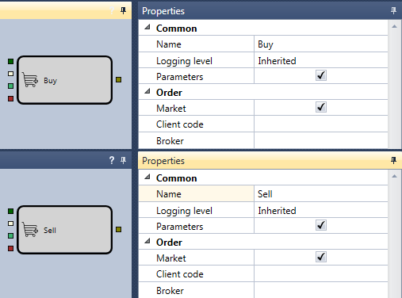
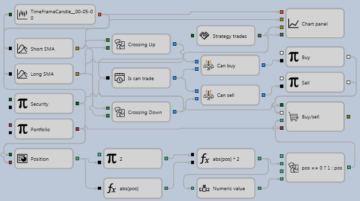

# Erste Strategie

Zum Erstellen von Strategie-Schemas und zusammengesetzten Elementen sowie zum Testen der erhaltenen Strategien auf historischen Daten können Sie das Beispiel einer Strategie mit gleitendem Durchschnitt (SMA) verwenden. Es führt Sie durch den vollständigen Ablauf vom Erstellen einer Strategie bis zu deren Test und Debugging. Die Strategie mit gleitendem Durchschnitt (SMA) befindet sich im Ordner **Strategien** des Panels **Schemata**.

1. Erstellen Sie eine neue Strategie aus Würfeln, wie unter [Code verwenden](../using_code.md) beschrieben. Um eine neue Strategie hinzuzufügen, klicken Sie auf die Schaltfläche **Hinzufügen**  auf der Registerkarte **Allgemein** und wählen **Strategie** aus. Alternativ klicken Sie mit der rechten Maustaste auf den Ordner **Strategie** im Panel **Schemata** und klicken im Dropdown-Menü auf die Schaltfläche **Hinzufügen** .

Nach dem Klicken auf die Schaltfläche **Hinzufügen**  im Ordner **Strategie** des Panels **Schemata** erscheint eine neue Strategie. Im Arbeitsbereich erscheint ein neuer Tab mit der Strategie; beim Wechsel dorthin wird automatisch die Registerkarte **Emulation** im Menüband geöffnet. Auf der Registerkarte **Emulation** können Sie den Namen der Strategie ändern und ihr eine kurze Beschreibung geben.

2. Öffnen und fixieren Sie für komfortables Arbeiten die Panels **Palette** und **Eigenschaften** des Bereichs **Schemata**, indem Sie auf die Schaltfläche  klicken. Das Ergebnis ist ein Fenster der folgenden Art.

3. Das Wesen der Strategie mit gleitendem Durchschnitt (SMA) ist wie folgt:

- Es gibt zwei gleitende Durchschnitte mit unterschiedlichen Berechnungsperioden, einen langen SMA und einen kurzen SMA. Im Beispiel heißt der Würfel [Indikator](elements/common/indicator.md) für den langen SMA Long SMA mit einer Periode von 80 Kerzen; der kurze SMA heißt Short SMA mit einer Periode von 10 Kerzen.
- Wenn der kurze gleitende Durchschnitt den langen von unten nach oben kreuzt, wird eine Long-Position eröffnet.
- Wenn der kurze gleitende Durchschnitt den langen von oben nach unten kreuzt, wird eine Short-Position eröffnet.
- Wenn zum Zeitpunkt des Signals zum Eröffnen einer Position eine entgegengesetzte Position vorhanden ist, wird die Position gedreht.

4. Für alle Strategien benötigen Sie ein Instrument und ein Portfolio, die für Trades verwendet werden. Sie sollten diese aus dem Panel **Palette** in das Panel **Designer** hinzufügen. Im Beispiel heißt der Würfel [Variable](elements/data_sources/variable.md) mit dem Typ **Instrument** Instrument, und der Würfel [Variable](elements/data_sources/variable.md) mit dem Typ **Portfolio** heißt Portfolio. Setzen Sie das Kontrollkästchen **Parameters** der Würfel Instrument und Portfolio. Wenn das Kontrollkästchen aktiviert ist, übernimmt der Würfel den Wert aus den Strategieeinstellungen. Wenn Sie das Kontrollkästchen nicht aktivieren, müssen Sie die Werte für Instrument und Portfolio manuell eingeben. Wenn Sie das Feld Value des Würfels [Variable](elements/data_sources/variable.md) leer lassen und das Kontrollkästchen für Parameter nicht setzen, gibt die Strategie während des Tests einen Fehler wegen des nicht gesetzten Werts des Würfels [Variable](elements/data_sources/variable.md) aus.

Wenn Sie in der Strategie mehrere Instrumente oder Portfolios verwenden müssen, deaktivieren Sie für jeden Würfel das Kontrollkästchen **Parameters** und setzen Sie den Wert des Instruments oder Portfolios.

5. Nach dem Hinzufügen von Instrument und Portfolio fügen Sie zwei Würfel [Indikator](elements/common/indicator.md) hinzu, wählen den SMA-Typ aus, nennen den ersten Long SMA und setzen die Periode auf 80 Kerzen, nennen den zweiten Short SMA und setzen die Periode auf 10 Kerzen.

6. Damit die Indikatoren funktionieren, übergeben Sie ihnen eine Kerzenserie. Erstellen Sie dazu den Würfel [Kerzen](elements/data_sources/candles.md). Im Beispiel werden nur vollständig gebildete Kerzen mit einem Zeitrahmen von 5 Minuten verwendet.

7. Nach dem Hinzufügen der Indikatoren müssen Sie zwei Würfel hinzufügen, die die Kreuzungen der Indikatoren bestimmen. Dies sind die Würfel [Kreuzung](elements/common/crossing.md) aus den zusammengesetzten Elementen. Der erste Würfel heißt Crossing Up. Er bestimmt die Kreuzung von unten nach oben. Der Indikator Short SMA wird an den oberen Eingang des Würfels übergeben, der Indikator Long SMA an den unteren Eingang. Der Operator CurrComparison wird auf einen größeren Wert gesetzt, der Operator PrevComparison auf kleiner oder gleich. Der zweite Würfel heißt Crossing Down und bestimmt die Kreuzung von oben nach unten. Der Indikator Short SMA wird an den oberen Eingang des Würfels übergeben, der Indikator Long SMA an den unteren Eingang. Der Operator CurrComparison wird auf einen kleineren Wert gesetzt, der Operator PrevComparison auf größer oder gleich.

8. Fügen Sie [Chart](elements/common/chart.md) hinzu, um Kerzen, Indikatoren und Trades visuell anzuzeigen. Fügen Sie dem [Chart](elements/common/chart.md) Anzeigeelemente für Kerzen, zwei Indikatoren und Trades hinzu.

9. Als Quelle der Trades für die Anzeige im Chart wird der Würfel **Trades** der Strategie verwendet. Im Beispiel heißt er Strategy trades.

10. Um eine Position zu eröffnen, fügen Sie zwei Würfel [Register order](elements/orders/register.md) hinzu. Der erste Würfel ist für den Kauf per Market-Order vorgesehen. An den Eingang dieses Würfels werden übergeben: **Instrument**, das Signal zum Eröffnen einer Position aus dem Würfel Crossing Up, **Portfolio** und das Ordervolumen. Der zweite Würfel ist für den Verkauf per Market-Order vorgesehen. An den Eingang dieses Würfels werden übergeben: **Instrument**, das Signal zum Eröffnen einer Position aus dem Würfel Crossing Down, **Portfolio** und das Ordervolumen.

11. Durch Verbinden der oben genannten Elemente mit Linien ([Linien](lines.md)) entsteht ein Schema, das die aktuelle Position der Strategie noch nicht berücksichtigt. In diesem Zustand sammelt es eine übermäßige Anzahl von Lots an.

Zur Positionskontrolle müssen Sie den Würfel [Position](elements/positions/current.md) hinzufügen, an dessen Eingang **Instrument** und **Portfolio** übergeben werden.

Zur Verarbeitung der aktuellen Position können Sie das fertige Schema verwenden, das unter [Aktuelle Position abrufen](schema_samples/get_current_position.md) beschrieben ist. Dieses Schema bestimmt den tatsächlichen Wert des erforderlichen Ordervolumens. Wenn die Position gedreht werden muss, gibt es den doppelten Portfoliowert zurück.

12. Als Ergebnis sieht die fertige Strategie so aus:

## Empfohlene Inhalte

[Zusammengesetzte Elemente](composite_elements.md)

