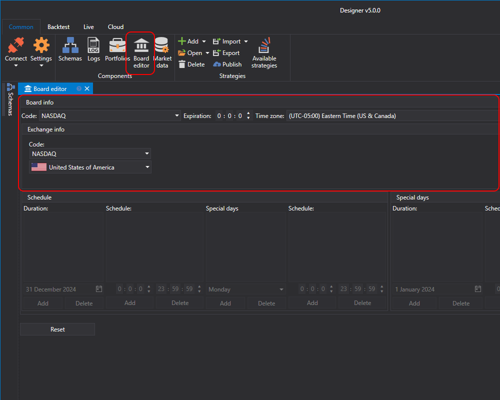

# Boards

Im Panel **Board editor** können Sie **Boards** und **Exchanges** erstellen sowie vorhandene anzeigen oder anpassen.

In [S#](../../api.md) verwenden Instrumente aus verschiedenen Quellen eine einheitliche Kennung, die aus dem Instrumentencode und dem Board-Code besteht. Die Syntax lautet [**instrument code**]@[board code]. Für Aktien von **AAPL** an der Börse **NASDAQ** lautet die Kennung zum Beispiel **AAPL@NASDAQ**. Jedes Instrument ist einem bestimmten Board zugeordnet, auf dem es gehandelt wird. Ein Instrument kann jedoch auf verschiedenen Boards gehandelt werden. In diesem Fall unterscheiden sich die Board-Codes. Für jedes Board können Sie einen Arbeitsplan mit Arbeitstagen und Wochenenden einrichten.

Die Börse kann mehrere Boards mit unterschiedlichen Handelsbedingungen haben (Sitzungszeit, Provision usw.). Jedes Board ist jedoch einer bestimmten Börse zugeordnet. Wenn Sie daher im **Board editor** ein Board auswählen, ändern sich die Informationen über die Börse automatisch zur Börse, auf der sich das Board befindet. Für jede Börse können Sie den Börsencode, das Land sowie den russischsprachigen und englischsprachigen Namen festlegen.

