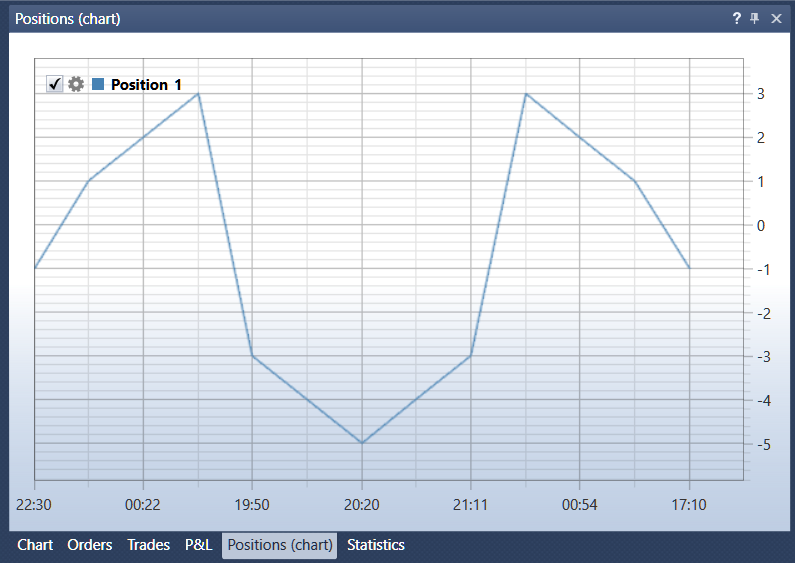

# Positions

Die Komponente **Positions (chart)** ist ein Chart der Position. In der oberen linken Ecke des Charts werden alle grafischen Elemente angezeigt, die dem Chart hinzugefügt wurden. Wenn Sie das Kontrollkastchen  beim grafischen Element deaktivieren, wird das Element aus dem Chart entfernt. Ein Klick auf die Schaltfläche  öffnet die Einstellungen des grafischen Elements.

Die Komponente **Positions** ist eine Tabelle mit Positionen für die Strategieinstrumente.

## Empfohlene Inhalte

[Statistics](statistics.md)

