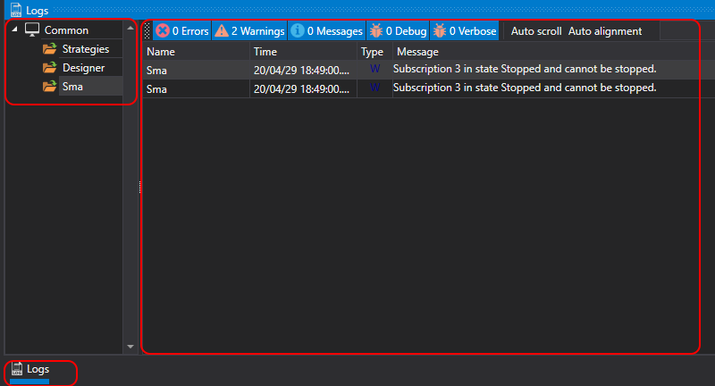

# Protokoll-Panel

Zur Vereinfachung der Überwachung des Programmbetriebs gibt es ein spezielles **Protokolle**-Panel. Dieses Panel zeigt Meldungen aus allen Quellen, Strategien und Verbindungen an. Im **Protokolle**-Panel wird die Verschachtelung der Quellen als Baum dargestellt. Jeder ubergeordnete Knoten enthält die Meldungen aller untergeordneten Quellen usw. bis zur untersten Ebene. Bei Strategien ermöglicht diese Hierarchie, untergeordnete Strategien zu sehen. Um das **Protokolle**-Panel zu öffnen, klicken Sie auf der Registerkarte **Allgemein** auf die Schaltfläche **Protokolle**.

## Siehe auch

[Portfolios](portfolios.md)
