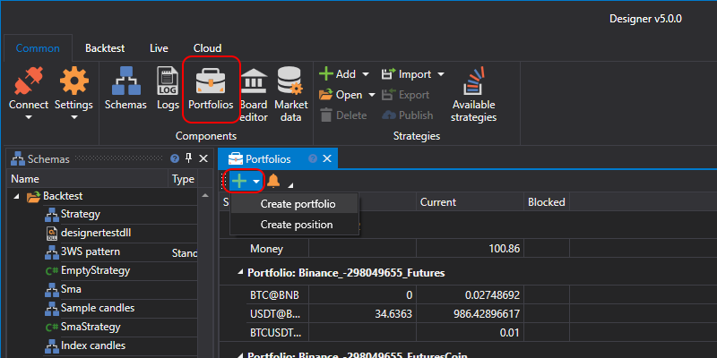

# Portfolios

Für die Arbeit mit Portfolios gibt es das Panel **Portfolios**. Sie können es öffnen, indem Sie auf der Registerkarte **Allgemein** auf die Schaltfläche Portfolios klicken.

Das Panel **Portfolios** ist eine Tabelle, die die grundlegenden Daten zum Portfolio sowie die aktuellen Positionen für diese Portfolios anzeigt. Durch Doppelklick auf ein Portfolio oder eine Position wird das Fenster **Portfolio erstellen** bzw. **Position erstellen** geöffnet, in dem Sie das ausgewählte Portfolio oder die ausgewählte Position bearbeiten können. Um ein neues Portfolio oder eine neue Position zu erstellen, klicken Sie auf die Schaltfläche  und wählen den entsprechenden Eintrag im Dropdown-Menü.

Wenn Sie auf die Schaltfläche  klicken, wird das Fenster [Benachrichtigungseinstellungen](../../terminal/notifications.md) geöffnet.

## Empfohlene Inhalte

[Strategiegalerie](../strategy_gallery.md)

