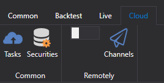

# Menüband

Das wichtigste Element der Benutzeroberfläche von [Designer](../../designer.md) ist das **Menüband**, das sich am oberen Rand des Anwendungsfensters befindet. Das Menüband ermöglicht schnellen Zugriff auf die benötigten Befehle. Die Befehle sind in logischen Gruppen organisiert, die auf Registerkarten zusammengefasst sind. Um zur gewünschten Registerkarte zu wechseln, klicken Sie einfach auf deren Titel (Namen). Jede Registerkarte ist mit der Art der ausgefuhrten Aktion verknupft.

1. Die Registerkarte **Allgemein**, die nach dem Start standardmäßig geöffnet wird, enthält Elemente, die in der Anfangsphase der Arbeit benötigt werden können. Über die Registerkarte **Allgemein** können Sie [Verbindungseinstellungen](../connections_settings.md), [Schemata-Panel](schemas.md), [Protokoll-Panel](logs.md), [Portfolios](portfolios.md), [Börsenplatz-Editor](boards.md) und [Erstellen eines Speichers für historische Daten](../market_data_storage/getting_started.md) öffnen. Außerdem können Sie auf der Registerkarte **Allgemein** Strategien hinzufügen, öffnen, löschen, importieren und exportieren. Wenn Sie Ihre Strategie mit der Community teilen möchten, können Sie dies über die Schaltfläche *Veröffentlichen* tun. Die danebenliegende Schaltfläche *Verfügbare Strategien* öffnet Algorithmen, die von Ihnen und anderen Benutzern veröffentlicht wurden. Rechts befinden sich Service-Schaltflächen zum Aufrufen der Hilfe sowie zur Kontaktaufnahme mit uns. Sie können ein Problem melden oder uns im Telegram-Chat schreiben.

2. Die Registerkarte **Rücktest** wird automatisch geöffnet, wenn auf dem Panel [Schema](schemas.md) eine Strategie ausgewählt wird. Die Registerkarte **Rücktest** enthält die wichtigsten Elemente zum Erstellen, Debuggen, Testen und Optimieren von Strategien ([Strategie erstellen](../strategies/using_visual_designer.md), [Rücktestbeispiel](../backtesting/getting_started.md)). Auf dieser Registerkarte wird die Strategie außerdem für den realen Handel gestartet, und die benötigten Komponenten für Ihre Strategie werden ausgewählt: Chart, Orderbuch, Trades usw.

3. Die Registerkarte **Live-Handel** ist speziell für den realen Handel vorgesehen. Details zu den Verbindungseinstellungen finden Sie unter [Verbindungseinstellungen](../connections_settings.md). Der reale Handel mit [Designer](../../designer.md) wird unter [Live-Handel](../live_execution/getting_started.md) beschrieben.

4. Die Registerkarte **Cloud**. [Designer](../../designer.md) ist für die Arbeit mit Cloud-Diensten ausgelegt. Sie ermöglicht das Anzeigen abgeschlossener *Cloud-Aufgaben*, das Abrufen von Informationen zu in der Cloud verfügbaren Instrumenten sowie das Einrichten der Remote-Arbeit mit Kanälen und Robotern.

## Siehe auch

[Arbeitsbereich](workspace.md)

