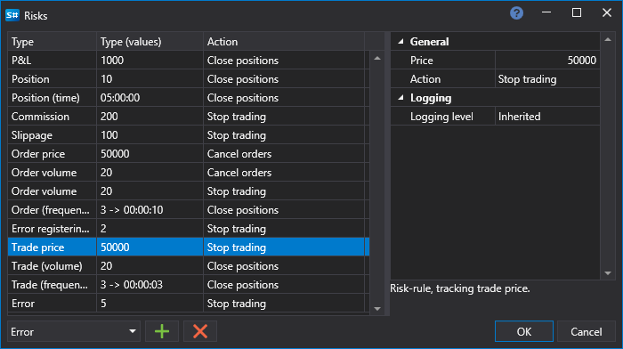

# Risikomanagement

In den Panels [Testing Properties](components/backtesting_settings.md) und [Live Trading Properties](components/live_settings.md) können Sie die Einstellungen für die Risikokontrolle festlegen.

Im Fenster Risks müssen Sie eine **Risikoregel** auswählen, die Auslosebedingung für die **Risikoregel** konfigurieren und die Aktion (Positionen schliessen, Handel stoppen, Orders stornieren) festlegen, die ausgeführt wird, wenn die Bedingung der **Risikoregel** eintritt.

Es ist möglich, mehrere Risikoregeln desselben Typs mit unterschiedlichen Aktionen zu verwenden. Im folgenden Screenshot werden beispielsweise bei einem Ordervolumen von 20 die Aktionen zum Stornieren von Orders und zum Stoppen des Handels ausgeführt.

### Liste der Risk Rules

Liste der Risk Rules

- **P/L** - eine Risikoregel, die die Hohe von Gewinn/Verlust uberwacht.
- **Position** - eine Risikoregel, die die Positionsgrosse uberwacht.
- **Position (Zeit)** - eine Risikoregel, die die Lebensdauer einer Position uberwacht.
- **Provision** - eine Risikoregel, die die Hohe der Kommission uberwacht.
- **Slippage** - eine Risikoregel, die die Hohe des Slippage uberwacht.
- **Auftragspreis** - eine Risikoregel, die den Preis einer Order uberwacht.
- **Auftragsvolumen** - eine Risikoregel, die das Volumen einer Order uberwacht.
- **Auftrag (Frequenz)** - eine Risikoregel, die die Haufigkeit der Orderplatzierung uberwacht.
- **Fehler bei Registrierung/Stornierung der Order** - eine Risikoregel, die die Anzahl der Fehler bei Registrierung/Stornierung von Orders uberwacht.
- **Ausführungspreis** - eine Risikoregel, die den Preis eines Trades uberwacht.
- **Ausführung (Volumen)** - eine Risikoregel, die das Volumen eines Trades uberwacht.
- **Ausführung (Frequenz)** - eine Risikoregel, die die Haufigkeit der Ausführung von Trades uberwacht.
- **Fehler** - eine Risikoregel, die die Anzahl beliebiger Fehler uberwacht.
