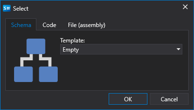

# Schemes Panel

Um das Panel **Schemes** zu öffnen, klicken Sie auf der Registerkarte **Common** auf die Schaltfläche **Schemes**. Das Panel **Schemes** enthält einen Baum von Skripten, die nach Zweck in Ordner gruppiert sind. Strategieschemata und benutzerdefinierte Blöcke unterscheiden sich nicht. Sie werden mit einem gemeinsamen Editor, dem [Strategie-Designer](../strategies/using_visual_designer/diagram_panel.md), bearbeitet. Um Verwechslungen zu vermeiden, sind sie jedoch in zwei unabhängige Listen aufgeteilt und werden in unterschiedlichen Ordnern gespeichert (Strategien im Ordner **Backtest**, benutzerdefinierte Blöcke im Ordner **Custom Blocks**). Die Auswahl eines Schemas zur Bearbeitung erfolgt durch Doppelklick auf den erforderlichen Eintrag in der Liste. Das ausgewählte Schema wird anschließend im Designer zur Anzeige und Bearbeitung geöffnet. Nachfolgend finden Sie eine Beschreibung der Ordner im Panel **Schemes**:

1. Der Ordner **Backtest** enthält Handelsstrategien, die sowohl als Schemata aus Elementen und deren Verbindungen als auch aus Code erstellt wurden. Sie können eine neue Strategie hinzufügen, indem Sie auf der Registerkarte **Common** auf die Schaltfläche **Add**  klicken und **Strategy** auswählen. Alternativ klicken Sie im Panel **Schemes** mit der rechten Maustaste auf den Ordner **Backtest** und wählen im Dropdown-Menü die Schaltfläche **Add** . Wählen Sie im geoffneten Fenster aus, wie genau Sie eine Strategie erstellen möchten.

    

    Strategien können mit einem visuellen Designer ohne Programmierung oder mit dem integrierten Quellcode-Editor erstellt werden. Zusätzlich können externe DLL-Dateien mit in Microsoft Visual Studio geschriebenen Strategien eingebunden werden. Ausführliche Informationen zu **Strategies** finden Sie im Abschnitt [Using Blocks](../strategies/using_visual_designer.md).

2. Der Ordner **Own elements** enthält Elemente, die eine abgeschlossene Funktionalitat darstellen und in verschiedenen Schemata oder mehrfach in einem Schema mit unterschiedlichen Eigenschaftswerten verwendet werden können. Solche Elementgruppen können in einen separaten Block ausgelagert werden, der anschließend wie jedes Standardelement verwendet wird. Ein **Custom block** ist ein normales Schema, das wie jedes Strategieschema gespeichert, geladen und bearbeitet wird. Fugen Sie ein neues zusammengesetztes Element hinzu, indem Sie auf der Registerkarte **Common** auf die Schaltfläche **Add**  klicken und **Custom Blocks** auswählen. Alternativ klicken Sie im Panel **Schemes** mit der rechten Maustaste auf den Ordner **Custom Blocks** und wählen im Dropdown-Menü die Schaltfläche **Add** . Neue benutzerdefinierte Blöcke werden automatisch zur **Element Palette** in der Gruppe **Custom Blocks** hinzugefügt und können beim Erstellen anderer Strategieschemata und benutzerdefinierter Blöcke verwendet werden. Ausführliche Informationen zu **Custom Blocks** finden Sie im Abschnitt [Creating composite elements](../strategies/using_visual_designer/composite_elements.md).

3. Der Ordner **Live** enthält Strategien, die für den Handel hinzugefügt wurden. Gestartete Strategien sind mit dem Symbol  markiert, gestoppte Strategien mit dem Symbol . Wie Strategien zum Ordner **Live** hinzugefügt und gestartet werden, ist im Abschnitt [Live trading](../live_execution/getting_started.md) beschrieben.

4. Der Ordner **Indicators** enthält Ihre eigenen Indikatoren für Handelsstrategien, die Sie selbst geschrieben haben. Neue Indikatoren können nicht mit Schemata erstellt werden; verfügbar sind nur Code und externe DLL-Dateien. Die Verwendung eigener Indikatoren in Schemata ist über den Block [Indicator](../strategies/using_visual_designer/elements/common/indicator.md) bei Auswahl des Indikatortyps möglich.

5. Der Ordner **Remote** enthält Strategien, die sich auf einem Remote-Server befinden.

## Siehe auch

[Logs Panel](logs.md)
